# KryptoVault Current Architecture

## Scope and evidence

This reference describes the checked-in source as inspected on 2026-09-17. Source code is authoritative. Files under `node_modules`, `.git`, generated Hardhat `artifacts`/`cache`, local `.env` files, and `.local-startup/logs` are excluded from implementation claims. The checked-in ABI copies are described because browser and verification code consume their interface. Runtime deployment configuration, including a hosted service's environment, is **UNCERTAIN — requires runtime verification**.

KryptoVault is a browser-led encrypted document application. The browser authenticates an Ethereum wallet with a signed challenge, encrypts/decrypts document bytes locally, stores an encryption-key identity in IndexedDB, submits ciphertext and wrapped keys to an Express API, and signs Ethereum Sepolia contract writes through MetaMask. MongoDB/GridFS persist encrypted data and metadata. The backend performs read-only Sepolia checks before returning protected content or accepting a blockchain-sync operation. `KryptoVaultAccess` is authoritative for registered asset ownership, permissions, hash, and current version.

## Overall architecture

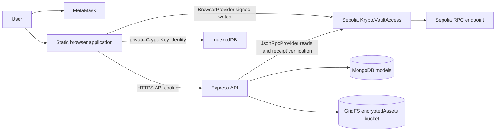

### Runtime shape

* `frontend/index.html` is a static, classic-script application. It loads ethers UMD, `api.js`, `crypto.js`, fixed blockchain config, `blockchain.js`, then `app.js`.
* `frontend/server.js` is a minimal Node HTTP static server. It generates `runtime-config.js` as `REAL_MODE`, except an explicit development `DEMO_MODE` request; it does not proxy APIs.
* `backend/src/server.ts` opens MongoDB, creates the Express app, and listens on `PORT` (default 4000). The frontend selects `http://localhost:4000` on localhost and its own origin otherwise, unless `window.KRYPTO_API_BASE_URL` is set. The prepared combined deployment serves a runtime override that always uses the same origin.
* Browser contract configuration is `0x87becA5241e43607ce2983608B1D479f97cD9a05`, chain ID `11155111`. The frontend rejects any other chain/address. The backend reader uses configured values; the new deployment preflight rejects noncanonical chain/address values before startup.
* `render.yaml` prepares one persistent Node service serving both frontends and `/api`, with a fresh Atlas database/GridFS store. `SERVE_FRONTEND=true` mounts only `frontend/dist`, produced by the explicit allowlist in `scripts/build-frontend.mjs`. No hosted deployment or complete live flow has yet been verified; see `docs/DEPLOYMENT.md`.

## Module maps

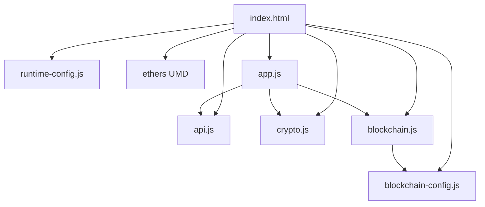

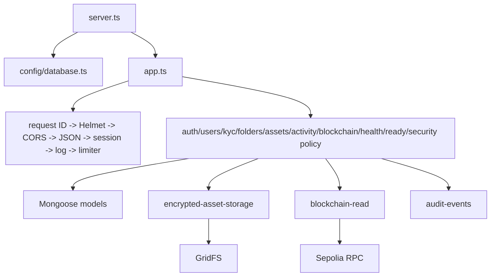

## Frontend

`app.js` owns a mutable in-memory `state` object for user, documents, shared documents, folders, activities, security policy, and UI preferences. It stores demo data and UI preferences in `localStorage`; account changes increment a generation token and clear account-scoped state so stale loads cannot overwrite the active wallet. There is no React/Vite runtime despite historical project instructions: source is vanilla browser JavaScript served by `server.js`.

The API client always uses `credentials: "include"`, JSON for ordinary bodies, `FormData` unchanged for encrypted uploads, rejects caller-supplied Authorization/Cookie headers, and turns error response bodies into `ApiError`. Network account and chain change listeners cause reauthentication/state clearing. Backend state is loaded on startup and refresh operations; there is no periodic polling loop found in source.

### Wallet authentication

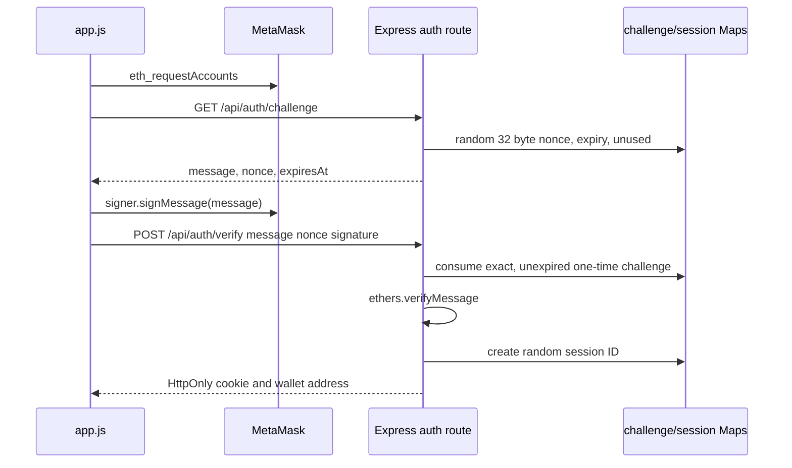

`initializeWalletSession` in `app.js` requests a challenge, signs it, verifies it, checks `/api/auth/me`, loads profile/KYC/security policy/workspace, and ensures the browser encryption identity is registered. Authentication proves control of the wallet recovered from the signature; the verify body does not contain a claimed wallet address.

### Browser cryptography and identity

`crypto.js` requires Web Crypto and IndexedDB. It generates a nonextractable RSA-OAEP/SHA-256 2048-bit key pair per normalized wallet and stores the `CryptoKey` pair and public SPKI Base64 identity in IndexedDB database `kryptovault-crypto-identity`, object store `keys`, key `document-encryption-identity:<lowercase-wallet>`. The browser sends only the Base64 public key to `PUT /api/users/me/encryption-key`. Private key recovery across browsers/profile deletion is not implemented.

| Operation | Input | Process | Output | Stored/accessed by |
|---|---|---|---|---|
| File fingerprint | File ArrayBuffer | `subtle.digest(SHA-256)` | lowercase 64-hex hash | Browser; backend/contract receive hash |
| File encryption | plaintext, generated AES key | AES-GCM 256 with random 12-byte IV | ciphertext, `{algorithm,iv,tag:"included-in-ciphertext"}` | ciphertext GridFS; metadata MongoDB |
| Owner/recipient wrapping | AES CryptoKey, public SPKI | RSA-OAEP/SHA-256 `wrapKey("raw")` | Base64 wrapped AES key | MongoDB WrappedKey; intended wallet unwraps |
| Password wrapping | AES key, password | random 16-byte salt; PBKDF2-SHA-256 (default 310000, configurable minimum 210000); AES-GCM with random IV | Base64 wrapped AES key plus KDF/key-encryption metadata | MongoDB owner WrappedKey; password holder |
| Opening | ciphertext, matching wrapped key | RSA private-key unwrap or PBKDF2 unwrap then AES-GCM decrypt | plaintext in browser memory | browser only |

No raw AES document key, document encryption private key, wallet private key, seed phrase, password, or password-derived key is intentionally sent to the API. AES keys are extractable only transiently for Web Crypto wrapping; this is required by `wrapKey`/password wrapping implementation.

### Upload and registration

```mermaid
sequenceDiagram
  participant UI as app.js/crypto.js
  participant API as assets route
  participant G as GridFS
  participant MM as MetaMask
  participant C as contract
  UI->>UI: SHA-256 plaintext; AES-GCM encrypt; wrap owner key
  UI->>API: POST /assets multipart ciphertext + metadata
  API->>G: store encrypted bytes under random storageId
  API->>API: create Asset, AssetVersion 1, WrappedKey, audit records
  API-->>UI: pending Asset
  UI->>MM: registerAsset(keccak256(application Mongo ID), 0xhash)
  MM->>C: signed transaction
  UI->>API: POST /assets/:id/blockchain-sync transactionHash
  API->>C: verify chain, deployed contract, receipt/event/sender/hash
  API-->>UI: ACTIVE verified asset
```

The upload request accepts multipart `encryptedFile` only, `application/octet-stream`, safe metadata fields, and at most the configured encrypted byte limit. It rejects recursively named secret fields. The API stores first; sync later changes `PENDING_BLOCKCHAIN` to `ACTIVE` only after `AssetRegistered` verification. Application asset IDs map to contract IDs as `BigInt(ethers.id(mongoObjectIdString))` / `keccak256(UTF-8 string)`.

### Grant, read, revoke, strong revoke

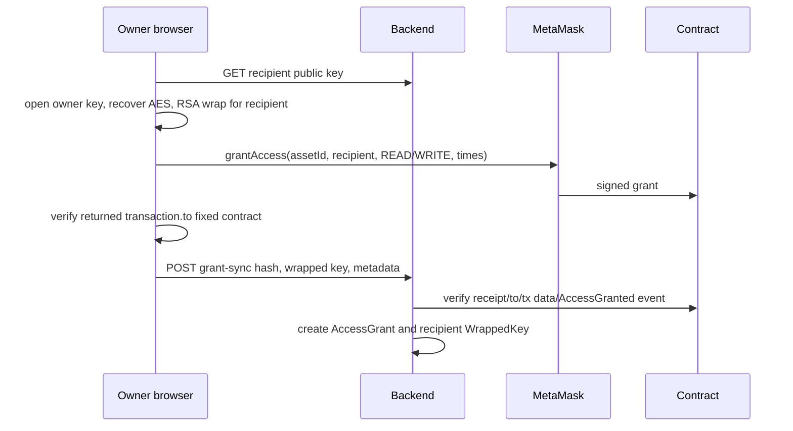

Before grant, `blockchain.js` checks `eth_chainId` and BrowserProvider network are 11155111, bytecode exists at the configured target, and returns a `Contract` bound to the canonical address. It validates returned transaction `to`. The API requires asset owner session; optionally requires the owner's stored KYC status to be `VERIFIED`; validates the grant window; verifies chain, bytecode, receipt success/from/to, transaction selector/arguments when transaction data is available, and a matching `AccessGranted` event before creation. Failed target validation logs only transaction hash, `txTo`, expected contract address, and chain ID.

Opening calls `/open`, then `/ciphertext`; both run blockchain permission/version/hash checks and require an active wrapped key for the caller/current version. Browser-side decryption hashes plaintext again for integrity UI. The server receives no plaintext during open.

Weak revoke signs `revokeAccess`, syncs a verified `AccessRevoked` receipt, marks matching grants `REVOKED` and target wrapped keys inactive. It cannot revoke a plaintext or a key a recipient already saved.

Strong revoke is a two phase flow. After weak revoke, `/strong-revoke/prepare` confirms on-chain owner, target permission NONE, database/current chain version/hash agreement, and returns all remaining currently authorized recipients and their public keys. The browser decrypts the current file, generates a new AES key and IV, re-encrypts the same plaintext, wraps the new key for every remaining recipient (password wrapping remains for password-protected owner), signs `commitVersion`, and posts new ciphertext/key set to `finalize`. Finalize verifies the version transaction and exact recipient set, creates AssetVersion, deactivates prior current-version WrappedKeys, creates the new ones, updates Asset version/hash, and records audits in a Mongo transaction when connected. The revoked recipient still may possess old material; current endpoint checks select only current version/active key.

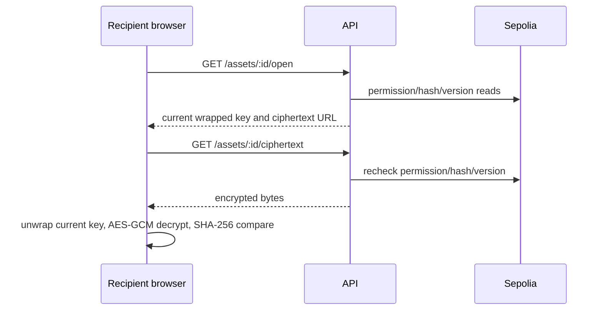

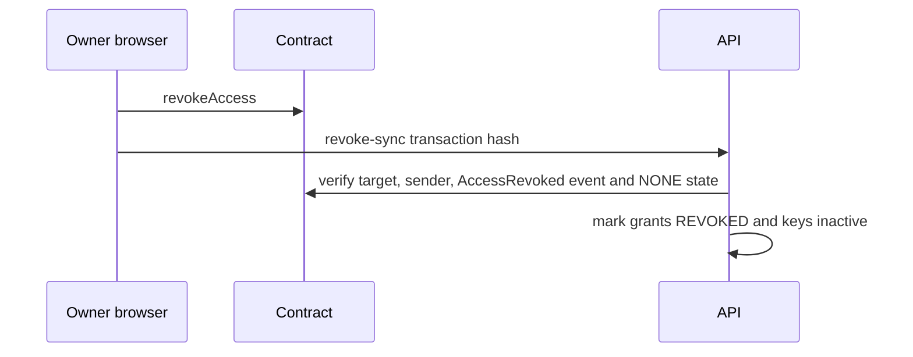

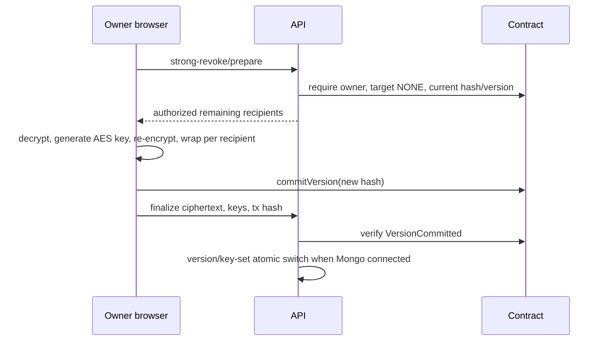

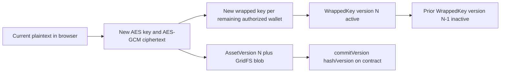

Folders are owner-only organizational metadata. There is no on-chain folder/group entity, folder permission, inherited permission, or group sharing.

## Backend request lifecycle

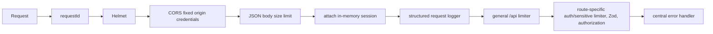

`createApp` disables `x-powered-by`, installs the listed middleware in that order, mounts routes, then `notFoundHandler` and `errorHandler`. Multer has route-local memory storage. `validateRequest` replaces parsed body/params/query and rejects unknown fields through strict Zod schemas. Error responses have code/message; stack traces are not returned. Logger redaction removes cookies, authorization, bodies, files, key material, credentials, and identity fields.

Sessions and challenges are `Map`s in one Node process: they are not Mongo models, have TTL checks on retrieval/consumption, and disappear on restart or do not share across instances. Mongo connection readiness is `mongoose.connection.readyState === 1`.

## Database and GridFS reference

All schemas use `strict: "throw"`; `schema-guards.ts` rejects schema definitions containing listed forbidden sensitive field names.

| Model | Key fields, indexes, lifecycle |
|---|---|
| User | lowercased unique `walletAddress`; optional public key, display name/email; `kycStatus` PENDING/VERIFIED/REJECTED, optional MOCK method/verifiedAt; timestamps. Created/upserted by profile/KYC/key routes. |
| Asset | owner, filename/size/MIME, current lowercase SHA-256, currentVersion default 1, status, optional blockchain ID, folder, registration tx/block, verification state, password flag; indexes owner/status and owner/folder. Created upload, updated sync/folder/strong revoke. |
| AssetVersion | Asset ObjectId, unique `(assetId,version)`, encrypted storage ID, AES metadata, SHA-256, creator, optional message/version tx; created upload and strong finalize. |
| WrappedKey | Asset/user/version, wrapped key and wrapping metadata, active; unique `(assetId,userWallet,version)`, indexes asset/user/active. Created upload/grant/finalize; deactivated revoke/finalize. |
| AccessGrant | asset/owner/grantee, READ/WRITE, optional dates/display/reason, unique blockchain tx, ACTIVE/REVOKED/EXPIRED and revoke timestamp; indexes asset/grantee/status, grantee/status, owner/asset. Created grant sync; status changes revoke/list expiration handling. |
| Folder | owner/name/optional parent ObjectId, timestamps; owner/parent index. Created and deleted only by owner. |
| AuditEvent | wallet, optional Asset ref, fixed action enum, safe detail, optional unique non-null tx hash, timestamp; wallet/time and asset/time indexes. Written by auth/assets. |
| AssetAuditEvent | asset, owner, actor, event type, optional old/new folder, createdAt; asset/time and owner/time indexes. Written upload/move/revoke/strong revoke. |

GridFS bucket name is `env.GRIDFS_BUCKET_NAME` (default `encryptedAssets`). `encrypted-asset-storage.ts` creates random 32-byte hex `storageId`, uploads memory ciphertext with metadata `{storageId}`, reads/deletes by `metadata.storageId`, and validates format. AssetVersion stores that ID, never GridFS ObjectId. On upload/finalize failure after storage, route code attempts deletion. Old version GridFS blobs are retained by strong revoke; no source path deletes historical versions.

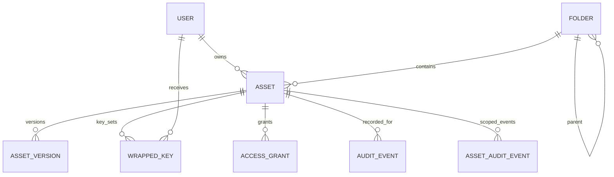

## Contract

`blockchain/contracts/KryptoVaultAccess.sol` is the sole Solidity contract. It has no inheritance. It stores an `Asset` struct per `uint256` with owner, SHA-256 bytes32, version, and existence; a nested permission mapping per asset/wallet with `Permission` enum (`NONE`, `READ`, `WRITE`) and validity window; and exposes owner/hash/version/permission queries. Access validity treats a permission as unavailable before `validFrom` or after nonzero `validUntil`.

| Function | Caller/validation | State change | Event | Frontend/backend use |
|---|---|---|---|---|
| `registerAsset(uint256,bytes32)` | asset absent, nonzero hash | asset owner=msg.sender, version=1 | `AssetRegistered` | frontend write; backend registration verification |
| `grantAccess(uint256,address,Permission,uint64,uint64)` | existing asset, owner only, nonzero grantee, permission not NONE, valid time range | permission/window | `AccessGranted` | frontend write; backend grant verification |
| `revokeAccess(uint256,address)` | existing asset, owner only | permission NONE/window zero | `AccessRevoked` | frontend write; backend revoke verification |
| `commitVersion(uint256,bytes32)` | existing asset, owner or WRITE permission, nonzero hash | hash and increment version | `VersionCommitted` | frontend strong revoke write; backend verify |
| `ownerOf`, `getPermission`, `currentHashOf`, `currentVersionOf` | existing asset (permission query applies time) | none | none | backend reads |

Events include indexed asset ID and principals: `AssetRegistered(assetId,owner,sha256Hash,version)`, `AccessGranted(assetId,owner,grantee,permission,validFrom,validUntil)`, `AccessRevoked(assetId,owner,grantee)`, and `VersionCommitted(assetId,committer,sha256Hash,version)`. On chain: ownership, permission/window, hash, version and events. Off chain: ciphertext, file name/type/size, wrapped keys, public key, reasons, KYC, folders, sessions, and audit records.

## API reference

All `/api` routes use the general limiter; `/api/auth/*` also uses auth limiter. `requireAuth` means a valid `secure_vault_session` map entry. Asset-specific authorization additionally queries contract state where indicated.

| Method route | Auth and major checks | Main reads/writes | Frontend caller |
|---|---|---|---|
| GET `/auth/challenge` | auth limiter | create challenge Map | login |
| POST `/auth/verify` | strict message/nonce/signature; one-time challenge; signature recover | audit, session Map/cookie | login |
| POST `/auth/logout` | optional session | delete map entry/cookie clear | logout |
| GET `/auth/me` | session | none | session verification |
| GET/PATCH `/users/me` | session; strict profile fields | User upsert/read | profile/bootstrap |
| PUT `/users/me/encryption-key` | session; strict public key | User upsert | crypto identity registration |
| GET `/users/:wallet/public-key` | public wallet param | User read | sharing |
| GET `/kyc/status` | session | User upsert/read | bootstrap |
| POST `/kyc/mock-verify` | session + strict status | User MOCK KYC update | demo KYC button |
| GET/POST `/folders` | session, create strict parent/name | Folder reads/create | workspace/create folder |
| GET/DELETE `/folders/:folderId` | owner; delete requires no owner assets | Folder/Asset reads/delete | folder UI |
| GET `/activity` | session; verifies shared permissions | WrappedKey/Asset/Audit reads + chain reads | activity UI |
| GET `/activity/assets/:assetId` | session + owner or contract read permission | Asset/Audit reads + chain read | not primary frontend path |
| GET `/blockchain/records` | session; contract visibility | Asset/WrappedKey reads + chain reads | blockchain page |
| GET `/security-policy` | none | env flag only | bootstrap |
| GET `/health` | none | none | launcher/health |
| GET `/ready` | none | mongoose ready state | launcher/readiness |
| GET `/assets` | session, optional folder filter | owner Assets | workspace |
| GET `/assets/my` | session, search/folder strict query | owner Assets | workspace |
| GET `/assets/shared-with-me` | session; active wrapped key and chain permission | keys/grants/assets + chain reads | shared UI |
| POST `/assets` | session, Multer encrypted file + strict multipart schema | GridFS + Asset/Version/Key/audits | upload |
| POST `/assets/:id/blockchain-sync` | owner, strict tx hash | Asset/audit write + chain receipt/event verify | upload |
| GET `/assets/:id/access` | owner | grants/keys reads, expiry state changes | document access tab |
| POST `/assets/:id/access/grant-sync` | owner, optional KYC, strict grant data | grants/key/audits + chain tx/event verify | grant |
| POST `/assets/:id/access/revoke-sync` | owner, strict hash | grant/key/audits + chain tx/event verify | revoke |
| POST `/assets/:id/access/strong-revoke/prepare` | owner, revoked on chain | user/key/grant reads + chain checks | strong revoke |
| POST `/assets/:id/access/strong-revoke/finalize` | owner, encrypted upload, exact recipient set | GridFS, version/key/asset/audits + version tx verify | strong revoke |
| PATCH `/assets/:id/folder` | owner, strict folder nullable | Asset/AssetAudit/Audit writes | move UI |
| GET `/assets/:id/blockchain` | owner or on-chain read/write | Asset read + chain reads | document blockchain tab |
| GET `/assets/:id/integrity` | owner or chain read/write | Asset/version/key read + chain hash/version | integrity UI |
| GET `/assets/:id/activity` | owner or chain read/write | Audit reads + chain checks | document activity tab |
| GET `/assets/:id/open` | active asset, contract permission, active current wrapped key | Asset/version/key/audit + chain reads | open/decrypt |
| GET `/assets/:id/ciphertext` | same authorization | GridFS read + chain checks | open/decrypt |

## Trust boundaries and limitations

* Browser code and request bodies are untrusted. The backend derives owner from session, uses explicit Zod schemas, never accepts request-body Mongo filters, and rechecks contract state for protected asset reads.
* MetaMask holds the wallet private key and signs messages/transactions. It is never sent to code in this repository.
* IndexedDB protects neither against same-origin XSS nor device/browser-profile compromise; it holds the CryptoKey private key. **DESIGN LIMITATION.**
* MongoDB/GridFS compromise reveals ciphertext, metadata, public keys, wrapped keys, hash, and audit data; it does not by itself provide private RSA keys or passwords.
* The backend can read ciphertext/wrapped key material but source does not perform decryption. A backend attacker can still serve/replace responses unless other infrastructure protects it. **DESIGN LIMITATION.**
* Contract state is authoritative for owner and `READ`/`WRITE` authorization. Mongo AccessGrant/WrappedKey records are delivery metadata, not authority.
* Revocation blocks future authorized API retrieval based on live chain state. It cannot erase already decrypted/downloaded plaintext, captured AES keys, screenshots, or previously fetched ciphertext. Strong revoke changes the current key/version but preserves historical data in storage. **DESIGN LIMITATION.**
* Challenge/session Maps are process-local and lack sweeping cleanup beyond access/consume. **VERIFIED ISSUE:** horizontal scaling/restart invalidates sessions/challenges.
* The combined deployment explicitly uses same-origin API requests and secure host-only SameSite=Lax cookies. Separate hosting can still use the existing API override and configurable SameSite=None, but must independently verify HTTPS, CORS and third-party-cookie restrictions.

## On-chain and off-chain placement

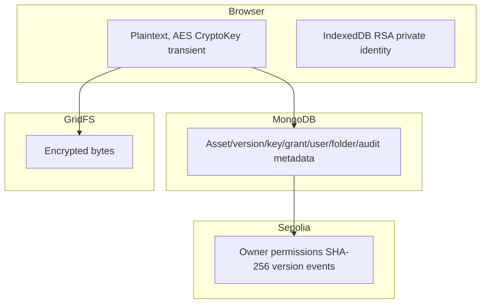

| Data | Browser memory/storage | Backend DB | GridFS | Chain | Reason |
|---|---|---|---|---|---|
| Plaintext file | transient memory | no | no | no | client encryption/decryption |
| Ciphertext | transient upload/download | storage reference | yes | no | large encrypted blob |
| Raw AES key | transient CryptoKey | no | no | no | wrapped distribution only |
| Wrapped AES key | transient | WrappedKey | no | no | recipient-specific delivery |
| RSA private key | IndexedDB CryptoKey | no | no | no | user decrypt capability |
| RSA public key | IndexedDB/public response | User | no | no | wrapping discovery |
| Wallet address | state/local demo data | User/assets/events | no | owner/permissions/events | identity/authorization |
| Wallet private key | MetaMask only | no | no | no | signer secret |
| SHA-256 | browser/hash metadata | Asset/Version | no | yes bytes32 | integrity/current version |
| Permissions/windows | UI cache | AccessGrant metadata | no | yes | chain authority |
| Grant reason | UI/API payload | AccessGrant | no | no | off-chain display metadata |
| Session/challenge | cookie / none | process Maps | no | no | authentication |
| Folder/KYC/policy | UI state | Folder/User / env | no | no | not contract data |

## Deployment and configuration

| Variable | Required by parser | Default | Used in | Secret |
|---|---:|---|---|---|
| `NODE_ENV` | no | development | backend logging/cookie; frontend server | no |
| `PORT` | no | 4000 backend, 8000 frontend | listeners | no |
| `MONGODB_URI` | yes backend | none | mongoose connection | yes |
| `MONGODB_DATABASE` | no | URI DB | mongoose connect | no |
| `CORS_ORIGIN` | no | Render external URL or localhost:8000 | exact CORS origin, HTTPS required in production | no |
| `SERVE_FRONTEND` | no | false | serve the allowlisted production frontend alongside API | no |
| `TRUST_PROXY_HOPS` | no | 0; Blueprint sets 1 | trusted proxy count for client IP/rate limiting | no |
| `SESSION_COOKIE_SAME_SITE` | no | legacy origin-based behavior; Blueprint sets lax | HttpOnly cookie issuance and clearing | no |
| body/rate/session/nonce/upload variables | no | env parser values | middleware/auth/upload | no |
| `REQUIRE_KYC_BEFORE_SHARING` | no | false | grant sync/policy endpoint | no |
| `ETHEREUM_RPC_URL` / compatibility `BLOCKCHAIN_RPC_URL` | no | public Sepolia URL | JsonRpcProvider | often secret/provider credential |
| `CONTRACT_ADDRESS` | parsed | canonical Sepolia address | backend contract construction; deployment preflight enforces canonical address | no |
| `EXPECTED_CHAIN_ID` / compatibility `CHAIN_ID` | no | 11155111 | provider checks | no |
| `KRYPTO_FRONTEND_MODE` / `FRONTEND_MODE` | no | REAL_MODE | frontend server mode | no |
| `KRYPTO_API_BASE_URL` | browser global | host-selected base | API client | no |
| `KRYPTO_PASSWORD_KDF_ITERATIONS` | browser global | 310000 | PBKDF2 | no |
| `SEPOLIA_RPC_URL`, `DEPLOYER_PRIVATE_KEY` | deploy config | none | Hardhat Sepolia deploy | yes |

`start-kryptovault.ps1` remains the local launcher. Root `vercel.json`/`server.ts` exist, but are not the selected hosting path because sessions/challenges are process-local. Root `render.yaml` uses a single persistent Node process; `start:deploy` checks Sepolia and Atlas transaction support, prepares schema/GridFS indexes additively, then starts the server. The Blueprint targets a fresh database and does not seed application records. Public RPC configuration uses `https://ethereum-sepolia-rpc.publicnode.com`, verified for chain ID and canonical bytecode during preparation. Hardhat deployment tooling remains separate and is not invoked by application deployment. See `docs/DEPLOYMENT.md` for missing credentials/source publication and the pending live acceptance checklist.

## Test architecture

Backend Vitest tests use setup env and mocks/in-memory model stubs; they test middleware, model constraints, routes, storage, and blockchain receipt/event verification. They do not perform live MongoDB, live Sepolia, browser IndexedDB, or real MetaMask transactions. Frontend Node tests run `crypto.js`/`blockchain.js` in mocked browser contexts and source-string assertions. Hardhat tests deploy/test the Solidity contract in its test network. **UNCERTAIN — requires runtime verification:** CORS cookie behavior, production RPC/provider behavior, and full browser upload against Atlas.

## File-by-File Codebase Reference

The following compact entries account for every relevant tracked implementation, configuration, documentation, ABI, and test file. Package lockfiles are dependency resolution snapshots, not executable architecture.

### Root files
`AGENTS.md` defines repository security/coding constraints; `README.md`, `setup_guide.md`, `COPILOT_PROJECT_CONTEXT.md`, `COPILOT_WORK_RULES.md`, and `docs/FINAL_INTEGRATION_PLAN.md` are documentation only and may contain legacy/planned statements; they are not used at runtime. `package.json` exposes `dev:all`; `.gitignore` excludes secrets/build dependencies; `start-kryptovault.ps1` is the Sepolia-aware launcher described above.

### frontend/index.html
Purpose: static page and all UI modal/page markup. Dependencies: styles and ordered scripts. Used by `server.js`. Security: script ordering ensures crypto/config load before `app.js`.

### frontend/styles.css
Purpose: presentation only for pages, forms, tabs, modals, responsive layout. It handles no data, authorization, or cryptography.

### frontend/runtime-config.js and frontend/server.js
Purpose: default real-mode globals and static serving/runtime replacement. `server.js` path-normalizes requested files, prevents traversal, sends no-store caching, and only permits demo mode in nonproduction.

### frontend/api.js
Purpose: `window.KryptoVaultApi` HTTP wrapper. Exports GET/POST/PUT/PATCH/delete/base URL helpers and `ApiError`; sends cookies and safe headers. Used throughout `app.js` and `crypto.js`.

### frontend/crypto.js
Purpose: browser encryption identity, hashing, AES encryption/decryption, RSA/password wrapping. Exports `window.KryptoVaultCrypto`; details are in Browser cryptography above. Security: IndexedDB private CryptoKeys never enter API payloads.

### frontend/blockchain-config.js and frontend/KryptoVaultAccess.abi.json
Purpose: canonical Sepolia config and browser ABI. Config is consumed by `blockchain.js`; ABI is fetched at `/KryptoVaultAccess.abi.json`. ABI is a static interface copy, not a deployment selector.

### frontend/blockchain.js
Purpose: `window.KryptoVaultBlockchain`. Loads ABI/config, enforces canonical Sepolia address/chain, switches/adds wallet network, checks bytecode, builds ethers BrowserProvider/Contract, maps IDs/permissions, and exposes register/grant/revoke/version transaction functions and receipt reads. Grant verifies returned transaction target.

### frontend/app.js
Purpose: application controller/UI state. It owns wallet lifecycle, backend loading, encryption upload/open, grant/revoke/strong revoke, integrity, folders, profile/KYC, activity rendering, demo-only state, and DOM listeners. Dependencies: all preceding frontend modules. Security: real mode requires wallet/backend path; demo controls are gated by runtime mode.

### frontend tests and config
`frontend/crypto.test.js` mocks browser primitives and exercises crypto helpers/identity/wrapping behavior. `frontend/blockchain.test.js` VM-loads blockchain helper, asserts no local RPC/deployment ABI dependency, checks Sepolia switch/config rejection behavior. `frontend/package.json` supplies ethers/dev/test scripts; lockfile pins it. `.env.example` is unused by static runtime; `.gitkeep` is empty placeholder. `frontend/README.md` documents use and is nonexecuting.

### backend/src/app.ts and server.ts
Purpose: Express factory/middleware/router mount order and startup/shutdown. Dependencies: config/database/logger/routes. `server.ts` disconnects Mongo on termination.

### backend/src/config/env.ts, database.ts, logger.ts, log-redaction.ts
Purpose: strict environment parse/aliases; Mongoose connection/readiness; Pino instance/security-event helper; Pino redaction paths. Database module is used by server/ready/storage; logger is used by request/auth/errors/blockchain. Tests: `database.test.ts`, `log-redaction.test.ts` verify connection and redaction policy.

### backend/src/auth/challenges.ts and session.ts
Purpose: one-time nonce challenge Map and cookie/session Map. Exports creation/consume/clear hooks and cookie parser/builders/attach middleware. Used by auth route/app. Security: random 32-byte tokens and TTL; nonpersistent process-local state.

### backend/src/middleware
`request-id.ts` assigns request identifiers; `request-logger.ts` writes safe request records; `rate-limit.ts` defines general/auth/sensitive limiters; `require-auth.ts` maps session wallet into `req.auth`; `asset-authorization.ts` provides owner/read/write chain checks; `validate-request.ts` runs Zod schemas; `not-found.ts` returns API 404; `error-handler.ts` maps HttpError/Zod/Multer/unexpected errors. Corresponding `*.test.ts` files cover their stated behavior and error paths.

### backend/src/models
`user.ts`, `asset.ts`, `asset-version.ts`, `wrapped-key.ts`, `access-grant.ts`, `folder.ts`, `audit-event.ts`, and `asset-audit-event.ts` define the schemas summarized above. `schema-guards.ts` bans sensitive schema fields. `index.ts` reexports models. `models.test.ts` asserts constraints/index-related behavior.

### backend/src/services
`encrypted-asset-storage.ts` is GridFS storage/read/delete abstraction; `audit-events.ts` records and serializes sanitized audit entries; `blockchain-read.ts` implements all chain reads and receipt/event verification, including canonical runtime address enforcement. Their test files mock providers/GridFS and exercise success/rejection cases including transaction-target mismatch.

### backend/src/routes
`auth.ts` implements challenge/verify/logout/me; `users.ts` profile/public-key endpoints; `kyc.ts` mock KYC; `folders.ts` owner folders; `activity.ts` authorized event feeds; `blockchain.ts` display record reconciliation; `health.ts`, `ready.ts`, `security-policy.ts` operational/policy reads; `assets.ts` all encrypted asset lifecycle endpoints. Each named `routes/*.test.ts` uses Supertest/mocks to cover the route group. `assets.test.ts` is the broadest: upload, sync, sharing, authorization, revocation, rotation, retrieval, and failures.

### backend project support
`backend/test/setup-env.ts` provides test environment values; `vitest.config.ts` wires it; `tsconfig.json` compiles strict NodeNext TS; `package.json`/lockfile define runtime/dev dependencies; `.env.example` documents required values without active secrets; `.gitignore` protects local env/build files; `README.md` is nonexecuting documentation.

### blockchain/contracts/KryptoVaultAccess.sol
Purpose: on-chain registry/authorization contract. Full storage/function semantics are in Contract above. Used by Hardhat deploy/test, browser ABI calls, and backend ABI-string verification.

### blockchain/hardhat.config.js, scripts, exports, tests
`hardhat.config.js` configures Solidity/compiler/Hardhat plus optional Sepolia. `scripts/deploy-local.js` deploys local and writes local export/env; `deploy-sepolia.js` deploys Sepolia and writes export/env/ABI; `export-abi.js` copies artifact ABI. `exports/KryptoVaultAccess.abi.json` and `frontend/KryptoVaultAccess.abi.json` are interface copies; `.local.json`/`local.env` are legacy local artifacts; `.sepolia.json` is the canonical exported deployment. `test/KryptoVaultAccess.test.js` tests ownership, grant/revoke, windows, write permission/versioning and input reverts. `package.json`/lockfile define Hardhat tooling; `.env.example` lists deploy RPC/key; `.env` is ignored secret runtime data; `.gitkeep` is placeholder; README is nonexecuting.

## AI Agent Handoff

Start with `frontend/app.js`, `frontend/crypto.js`, `frontend/blockchain.js`, `backend/src/routes/assets.ts`, `backend/src/services/blockchain-read.ts`, and `blockchain/contracts/KryptoVaultAccess.sol`. Treat frontend ABI, backend event ABI strings, Solidity signatures/events, and contract/chain configuration as a synchronized interface. Do not casually change `crypto.js`, WrappedKey schemas, auth/session logic, or asset authorization because small changes can make existing ciphertext inaccessible or bypass authorization.

To add an API route: define strict Zod input, mount it in `app.ts`, derive identity from `req.auth`, use explicit DB fields, route errors through `next`, add Supertest coverage, and update browser callers. To add a DB field: change strict schema, safe serializers/selects, explicit route writes, tests, and migration/compatibility handling. To add a contract function: implement/test Solidity, regenerate ABI copies, add frontend write/read API, add backend verification if synchronization trusts a transaction, and validate contract address/chain unchanged. Encryption changes need compatibility for old `encryptionMetadata`/`wrappingMetadata` records and a test proving an old file remains decryptable.

## Non Negotiable Security Invariants

* Never send/store wallet private keys, seed phrases, document RSA private keys, plaintext file/password, raw AES document keys, or password-derived keys in the backend.
* Keep plaintext encryption/decryption in browser Web Crypto and store only ciphertext in GridFS.
* Retain blockchain owner/READ/WRITE checks for protected API operations; Mongo permission records are not authorization authority.
* Keep transaction receipt/event/sender/target verification fail-closed. Grant target comparisons use normalized Ethereum addresses.
* Keep browser/backend ABI, canonical contract address `0x87becA5241e43607ce2983608B1D479f97cD9a05`, and Sepolia ID `11155111` synchronized.
* Preserve strict request schemas, safe explicit Mongo operations, security headers, CORS, rate limits, and log redaction.
