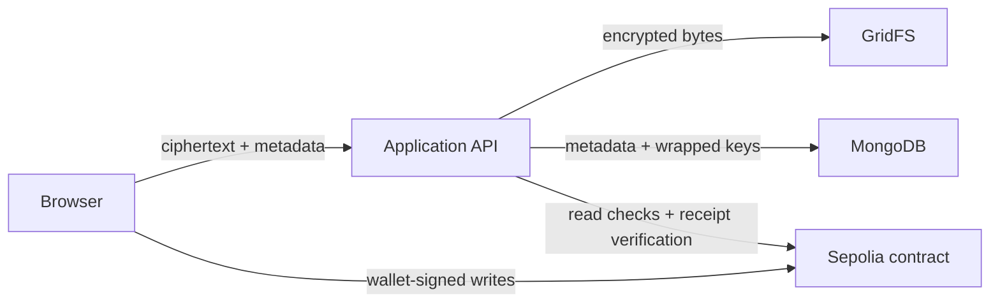
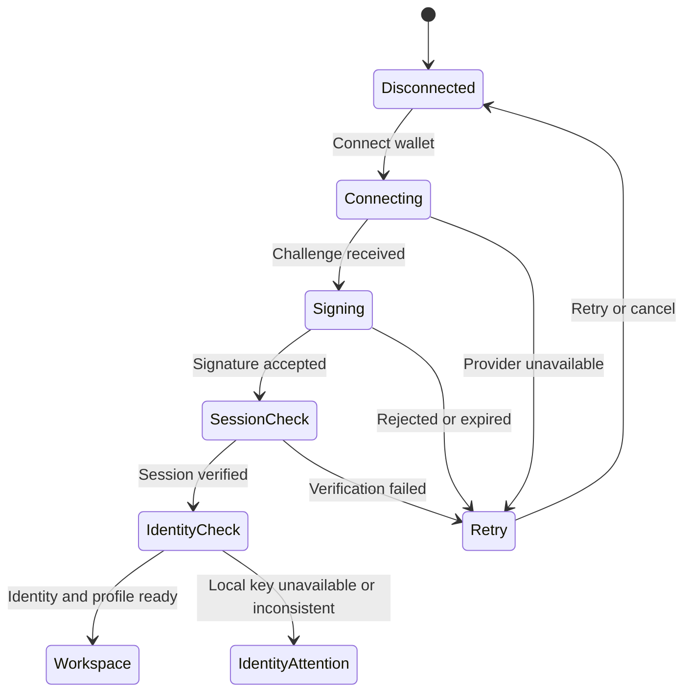

# KryptoVault — Complete Product and Landing-Page Design Specification

## 0. Document Status and Authority

This document specifies the intended KryptoVault public website and authenticated product interface. It consolidates the latest available design conversation, the existing `design.md`, and `SIH_ARCHITECTURE.md` (source inspection dated 2026-09-17). It is a design and implementation brief, not a claim that the redesign or every recommended interaction is already implemented.

It consolidates the final design direction and deliberately replaces the earlier landing-page reproduction specification. It describes the intended redesign, not merely the currently checked-in HTML/CSS/JavaScript page.

### 0.1 Decision precedence

When implementation details conflict, apply this order:

1. Security and product truth from the current KryptoVault architecture.
2. The latest design decisions in this document.
3. Accessibility and reduced-motion requirements.
4. Responsive and performance fallbacks.
5. Explicitly labelled implementation recommendations in this document. Superseded design alternatives are not part of the deliverable scope.

### 0.2 Final creative thesis

KryptoVault must feel like:

> **Swiss/editorial security design × cinematic infrastructure visualization.**

The finished identity is:

> **Monumental Inter typography + technical JetBrains Mono notation + Swiss editorial grids + flat institutional red and blue + cinematic black environments + engineered network visualization + precise, restrained interaction.**

### 0.3 Design principles

- **Security is shown through mechanisms, not clichés.** Display encryption, hashing, key wrapping, permission windows, versioning, and verification rather than padlock wallpaper or fake binary code.
- **Blockchain is infrastructure, not branding.** It supplies verifiable ownership, permissions, hash/version state, and events. It is not represented by coins, Ethereum logos, or speculative imagery.
- **Cinematic moments are concentrated.** The hero and selected storytelling sequences may be visually spectacular. Ordinary UI remains precise, flat, legible, and calm.
- **Editorial layouts carry the brand.** Oversized type, thin rules, sharp geometry, asymmetry, and controlled red/blue fields create continuity across public and authenticated surfaces.
- **Motion explains state.** Animation should reveal data flow, focus, hierarchy, and transitions. It must not exist merely to make every element move.
- **Claims must remain technically honest.** Never imply that revocation erases a downloaded plaintext file, that the blockchain stores encrypted documents, or that the backend never sees ciphertext and metadata.
- **The real product and the marketing page share one language.** The processing pipeline shown publicly becomes the compact functional upload pipeline inside the application.

### 0.4 Decision status and implementation status

Every requirement belongs to one of these categories:

- **Established direction:** the user's latest requests and the visual language repeatedly developed in the discussion. This includes the giant engineered mesh sphere, data traces, existing red/blue palette and fonts, environmental gradient philosophy, below-hero sticky navigation, selective oversized scroll typography, laptop/phone showcase, and functional processing line.
- **Carried-forward recommendation:** a specific design idea developed in the conversation that remains compatible with the latest direction, including the preloader, isometric document field, encryption/access/integrity/revocation demonstrations, architectural product frames, and alternating dark/light sections. Inclusion means it belongs in this specification; it does not imply separate explicit user approval for every micro-detail.
- **Additional implementation recommendation:** a concrete resolution supplied by this document for completeness. Exact measurements, stage timings, section grouping, default copy, route suggestions, accessibility controls, recovery screens, and component states fall here unless directly attributed to the conversation.
- **Architecture constraint:** a verified description in the supplied architecture reference. These constrain all visual claims. They are not a fresh source-code or deployed-runtime audit.

The global identity and named experiences are established; numeric values and detailed behavior are recommended defaults to validate in implementation. Product screens described here are design targets. A capability becomes a live action only when the current code actually supports it.

### 0.5 Scope of review

- The conversation excerpts and current design file available to this task provide the design evidence. They contain the latest supplied iterations; this document does not assert access to omitted messages.
- `SIH_ARCHITECTURE.md` supplies the current implementation boundaries, replacing historical stack assumptions.
- No live website, source repository, wallet transaction, or production deployment has been tested as part of creating this document.
- Exact original CSS values beyond those recorded in the design source are not inferred from screenshots. Added tokens and dimensions are recommendations.
- This document provides a complete specification. Building, migrating, deploying, or changing contract behavior is a separate implementation task.

### 0.6 Reading guide

- Sections 1–6: product truth, information architecture, global visual system, motion, universal components.
- Sections 7–23: complete landing-page narrative from initialization through footer.
- Sections 24–31: authenticated application screens and operation flows.
- Sections 32–38: responsive behavior, accessibility, resilience, content rules, implementation, and acceptance.
- Sections 39 onward: granular interaction contracts, production-state details, content inventory, and delivery review.

### 0.7 Document navigation

- [Product truth and audience](#1-product-truth-the-design-must-preserve)
- [Website information architecture](#3-overall-website-information-architecture)
- [Global visual language](#4-global-visual-language)
- [Motion and universal components](#5-motion-and-interaction-system)
- [Full landing-page specification](#7-landing-page--complete-narrative-and-section-order)
- [Authenticated application](#24-authenticated-product--global-application-shell)
- [Responsive strategy and accessibility](#32-responsive-strategy)
- [Implementation and acceptance](#37-implementation-architecture-recommendation)
- [Decision register](#40-decision-register-and-recommended-defaults)
- [Granular landing interactions](#43-granular-landing-interaction-specifications)
- [Authenticated state contracts](#45-authenticated-user-flows-and-state-contracts)
- [Delivery review plan](#48-implementation-boundaries-and-review-plan)


---

## 1. Product Truth the Design Must Preserve

### 1.1 System model

KryptoVault is a browser-led encrypted-document application:

- The browser authenticates an Ethereum wallet through a signed challenge.
- Plaintext file processing happens in the browser.
- The browser generates a SHA-256 file fingerprint.
- The browser encrypts file bytes with AES-256-GCM and a per-file key.
- The AES key is wrapped for the owner and separately for each authorized recipient with RSA-OAEP/SHA-256.
- Password-protected owner access may use PBKDF2-SHA-256 and AES-GCM wrapping.
- Only ciphertext and supporting metadata are uploaded to the backend.
- MongoDB stores application metadata, access-grant records, audit records, public keys, and wrapped keys.
- GridFS stores encrypted file bytes.
- MetaMask signs Sepolia contract writes.
- The contract is authoritative for registered ownership, `READ`/`WRITE` permission, validity windows, current hash, current version, and emitted events.
- The backend performs read-only contract checks and verifies transaction receipts/events before accepting synchronization.
- Decryption and the final SHA-256 comparison happen in the browser.

### 1.2 Truthful visual vocabulary

Use these real labels when technical text is visible:

```text
AES-256-GCM
SHA-256
RSA-OAEP
PBKDF2-SHA-256
READ
WRITE
VALID FROM
VALID UNTIL
WRAPPED KEY
VERSION / 04
ASSET REGISTERED
HASH VERIFIED
RECIPIENT / 0x91…A4
SEPOLIA / TEST NETWORK
CIPHERTEXT / STORED
PLAINTEXT SENT / NO
```

Avoid fabricated commands, random source code, meaningless hexadecimal wallpaper, or claims unsupported by the product.

### 1.3 Required trust distinctions

- **Client-side encryption** means the plaintext is encrypted before upload; it does not mean the device is immune to compromise.
- **Encrypted storage** is off-chain; the blockchain does not hold the document body.
- **Weak revocation** prevents future authorized retrieval through the current system and deactivates the recipient’s current access record. It cannot erase plaintext, screenshots, saved keys, or files already downloaded.
- **Strong revocation** creates a new AES key, re-encrypts the current plaintext, creates a new version, and wraps the new key only for remaining authorized users. It still cannot erase material previously obtained by a revoked user.
- **On-chain auditability** refers to contract state and events. Off-chain metadata and application audit records remain separate.
- **Wallet authentication** proves control of a wallet through a signed challenge. Never imply that KryptoVault receives a wallet private key or seed phrase.

### 1.4 Visual mapping of system responsibilities

| Layer | Brand color behavior | What the UI may say | What it must not imply |
| --- | --- | --- | --- |
| Browser | White/ink with blue process light | Encrypts, hashes, decrypts locally | Backend performs plaintext encryption |
| Encrypted storage | Deep blue or neutral technical panel | Ciphertext stored off-chain | Files are stored directly on-chain |
| Blockchain | Blue structural rails; red only for confirmed events | Ownership, permissions, hash/version, events | Blockchain hides document contents |
| MetaMask | Neutral wallet action, never a mascot | Sign message or transaction | Wallet secret enters KryptoVault |
| Recipient access | White/blue access graph | Wrapped key, READ/WRITE, validity | Sharing a raw AES key |
| Revocation | Red signal followed by blue re-key state | Future access removed; key rotated | Previously downloaded copies destroyed |

---

## 2. Audience and Experience Goals

### 2.1 Primary audiences

- **SIH judges and technical evaluators**
  - Need to understand the problem, architecture, security model, and differentiators quickly.
  - Should see a coherent relationship between the cinematic story and the functioning product.
- **Document owners**
  - Need simple upload, organization, sharing, verification, and revocation workflows.
  - Must always know whether an operation is local, off-chain, or on-chain.
- **Recipients**
  - Need clear permission state, expiry, provenance, and a safe path to open and verify a file.
- **Legal, finance, government, and enterprise users**
  - Need confidentiality, traceability, controlled access, and understandable audit evidence.
- **Developers and reviewers**
  - Need accurate architecture, algorithm labels, transaction state, and integration references.

### 2.2 First-visit goals

Within the first viewport, a visitor should understand:

1. KryptoVault protects documents.
2. Control begins on the user’s device.
3. The product combines encryption with verifiable access state.
4. The primary next action is to enter the vault.

Within the next two major sections, the visitor should understand:

1. Traditional sharing can leave persistent copies, mutable logs, or exposed storage.
2. KryptoVault encrypts before upload.
3. Encrypted bytes, application metadata, and blockchain state occupy different layers.

By the end of the page, the visitor should understand:

1. How sharing and expiry work.
2. What weak and strong revocation do.
3. How verification works.
4. That the product is usable on desktop and mobile layouts.
5. That KryptoVault is a serious security product, not a speculative Web3 concept.

### 2.3 Emotional sequence

The landing page should move through these states:

```text
Wonder → Recognition → Concern → Understanding → Control → Confidence → Action
```

- **Wonder:** engineered mesh sphere and living data paths.
- **Recognition:** human document categories and real file labels.
- **Concern:** visible weaknesses of ordinary document sharing.
- **Understanding:** local encryption and separated system layers.
- **Control:** recipient-specific permissions and expiry.
- **Confidence:** integrity checks, auditable state, and revocation.
- **Action:** enter the vault.

---

## 3. Overall Website Information Architecture

### 3.1 Public experience — logical destinations

**/**

- Cinematic landing page
    - Overview
    - Technology
    - Security
    - Use Cases
    - Architecture
    - Resources
- Login / Enter Vault

The public experience is one continuous narrative page. Anchor navigation may update the URL hash but must not require a client-side router.

### 3.2 Authenticated experience — recommended logical destinations

**/app**

- Workspace
    - My Files
    - Shared With Me
    - Folders
    - Upload
- Document Detail
    - Overview
    - Access
    - Integrity
    - Activity
    - Blockchain
- Activity
- Blockchain Records
- Profile / KYC
- Settings / Security Status

These are logical destinations, not verified HTTP routes. The current static application may use sections, modals, or hash state. Preserve working entry points and deep links; adopt `/app` or a separate login URL only with matching server handling.

### 3.3 Global navigation model

There are two different navigation states on the public page:

1. **Cinematic hero navigation**
   - Minimal and visually light.
   - Contains the KryptoVault wordmark and a direct `ENTER VAULT →` action.
   - Contains no duplicated section-link row; checkpoints belong to the bar below the hero.
   - Does not begin as a heavy solid bar covering the hero.

2. **Sticky section navigation**
   - Appears naturally immediately below the hero.
   - Becomes sticky when it reaches the top of the viewport.
   - Uses a solid `#1A1A1A` surface, white text, and a 2px red lower rule.
   - Provides persistent orientation throughout the editorial sections.

Desktop labels, in final order:

```text
KRYPTOVAULT
01 OVERVIEW
02 TECHNOLOGY
03 SECURITY
04 USE CASES
05 ARCHITECTURE
06 RESOURCES
ENTER VAULT →
```

### 3.4 Sticky navigation behavior

- Use `position: sticky; top: 0; z-index` high enough to clear all section content.
- Highlight the active section through:
  - a red lower rule,
  - a red square/dot marker, or
  - an inset red edge.
- Do not use rounded pills for active navigation.
- Reuse the original dual-line hover language:
  - a white 1px line enters from one side,
  - a red 1px line enters from the other.
- Clicking a label scrolls to its section with a sticky-header offset.
- Use `IntersectionObserver` for section entry. Within pinned narratives, use the narrative controller’s active chapter to keep navigation aligned with the visible content. Avoid repeated scroll-event layout reads.
- On mobile:
  - retain the wordmark and `ENTER VAULT →`,
  - expose section links through a labelled, full-width sharp-edged drawer,
  - preserve visible focus and 44px minimum targets,
  - do not use an unlabeled icon-only menu.

### 3.5 Authenticated application navigation

The application shell is separate from the public sticky anchor bar.

- **Desktop:** fixed or sticky left rail plus a compact top status bar.
- **Tablet:** collapsible left rail retaining icons with visible text on expansion.
- **Mobile:** top bar plus bottom navigation for the highest-frequency destinations.
- Primary destinations:
  - `WORKSPACE`
  - `SHARED`
  - `ACTIVITY`
  - `BLOCKCHAIN`
  - `PROFILE`
- Primary action:
  - `UPLOAD FILE`
- Global status indicators:
  - connected wallet abbreviation,
  - network name,
  - API/chain readiness when relevant,
  - KYC status if the policy requires it, with the mock method plainly identified where applicable.
- Status must use text plus color; never rely on a green/red dot alone.

---

## 4. Global Visual Language

### 4.1 Core personality

- Precise rather than ornamental.
- Monumental rather than crowded.
- Technical rather than cryptic.
- Serious rather than aggressive.
- Futuristic through structure and motion, not through genre clichés.
- High contrast with deliberate quiet zones.

### 4.2 Brand color tokens

The existing KryptoVault palette remains authoritative.

```css
:root {
  --kv-ink: #1A1A1A;
  --kv-black: #05070A;
  --kv-night: #071024;
  --kv-paper: #FFFFFF;
  --kv-surface: #F2F2F2;
  --kv-red: #D82C2C;
  --kv-blue: #0033A0;
  --kv-muted: #697271;
  --kv-muted-strong: #66706F;
  --kv-dark-copy: #C8CECD;
  --kv-rule: #DFE3E3;
  --kv-dark-rule: #3B3B3B;
  --kv-disabled: #8D9695;

  --kv-font-sans: Inter, Arial, sans-serif;
  --kv-font-mono: "JetBrains Mono", monospace;

  --kv-content-max: 1280px;
  --kv-radius: 0px;
  --kv-radius-functional: 4px;
}
```

### 4.3 Color semantics

- **Black / near black**
  - structure,
  - cinematic environments,
  - stable application chrome,
  - authority and contrast.
- **White**
  - editorial space,
  - clarity,
  - readable product surfaces,
  - breathing room between cinematic sequences.
- **Blue `#0033A0`**
  - infrastructure,
  - system routes,
  - verified storage/chain layers,
  - persistent structural emphasis.
- **Red `#D82C2C`**
  - user authority,
  - active decisions,
  - grant/revoke/commit events,
  - primary calls to action,
  - current selection.
- **Gray**
  - metadata,
  - supporting descriptions,
  - inactive steps,
  - rules and separators.

### 4.4 Red as a signal

Red must be scarce enough to remain meaningful.

- Use red for:
  - the main hero CTA,
  - a confirmed access grant pulse,
  - revoke actions,
  - a transaction commit event,
  - active navigation,
  - one or two document cards in a larger field,
  - essential focus/attention moments.
- Do not use red as a general decorative glow.
- Destructive and non-destructive red actions must be differentiated through text, confirmation structure, and context—not shade alone.

### 4.5 Gradient philosophy

The standard interface remains flat. Gradients are environmental light, never ordinary component decoration.

Allowed uses:

- radial blue illumination behind the engineered sphere,
- subtle atmosphere at the edge of dark sections,
- data-trail bloom,
- depth haze inside the mesh,
- light falloff across a 3D surface,
- a controlled transition from `#020305` through `#071024` toward blue.

Buttons, card surfaces, borders, and navigation use solid colors.

Reference environmental light:

```css
.cinematic-field {
  background:
    radial-gradient(circle at 50% 45%, rgba(0, 51, 160, 0.34), transparent 42%),
    radial-gradient(circle at 50% 115%, rgba(0, 51, 160, 0.16), transparent 44%),
    #05070A;
}
```

This is a lighting recipe, not a reusable card fill.

### 4.6 Typography

#### Inter

Use Inter 400, 500, 600, and 700 for:

- statements,
- navigation,
- section headings,
- card titles,
- descriptions,
- actions,
- product UI labels requiring quick reading.

#### JetBrains Mono

Use JetBrains Mono 400 and 500 for:

- section indices,
- algorithm names,
- hashes,
- addresses,
- timestamps,
- permission values,
- transaction/version state,
- captions,
- system status,
- technical footers.

#### Type scale

```css
:root {
  --type-display-hero: clamp(2.5rem, 8.2vw, 8.75rem);
  --type-display-section: clamp(2.25rem, 7vw, 7.5rem);
  --type-h1-app: clamp(2.5rem, 4vw, 4.5rem);
  --type-h2: clamp(2.25rem, 4.5vw, 4.75rem);
  --type-h3: clamp(1.5rem, 2.4vw, 2.25rem);
  --type-body-large: clamp(1.125rem, 1.5vw, 1.375rem);
  --type-body: 1rem;
  --type-meta: 0.75rem;
}
```

- Display headings use tight tracking between `-0.04em` and `-0.065em`.
- Large display headings use line height between `0.95` and `1.05`; the most compressed desktop compositions may approach `0.9` only after checking clipping. Ordinary headings remain more open.
- Body copy uses line height between `1.5` and `1.65`.
- Mono labels normally use `0.08em–0.12em` tracking and uppercase.
- Keep body copy in Inter and reserve JetBrains Mono for the defined technical roles.

### 4.7 Geometry

- Cards are square or nearly square-cornered.
- Default radius is `0`.
- A maximum `2–4px` radius is allowed only where an input, focus ring, scroll container, or touch affordance benefits.
- Structural rules are usually 1px.
- The sticky navigation lower rule is 2px red.
- Ordinary UI uses no decorative elevation shadows. Depth belongs to the cinematic object and intentional overlap; product hierarchy comes from solid surfaces, borders, scale, and spacing.
- Hierarchy comes from:
  - scale,
  - contrast,
  - border density,
  - overlap,
  - position,
  - surface color.
- Glass is limited to at most one or two sparse HUD overlays in cinematic areas. Product cards remain solid.

### 4.8 Grid and spacing

- Maximum content width: `1280px`.
- Desktop gutters: `24–32px`.
- Compact mobile gutters: `14–18px`.
- Primary layout grid: 12 columns.
- Editorial sections may use asymmetric `7/5`, `8/4`, or `5/7` spans.
- Cinematic scenes may extend beyond the content container, while their text remains aligned to it.
- Standard section padding:
  - desktop: `112–160px`,
  - tablet: `88–120px`,
  - mobile: `64–88px`.
- As an implementation starting point, the technology story may occupy `200–300svh` including its visible stage. Other stories should remain in normal flow by default. Add further pinning only after reading-speed and mobile checks; every pinned stage needs a normal-flow fallback.

### 4.9 Recurring motif: the encrypted block

A compact rectangular block represents an encrypted chunk. It may appear in:

- hero data traffic,
- the preloader progress rail,
- the document-to-ciphertext transition,
- architecture diagrams,
- button end marks,
- processing pipeline connectors,
- final CTA texture.

The motif should be subtle and geometric. It must not become a repeated decorative tile that overwhelms content.

---

## 5. Motion and Interaction System

### 5.1 Motion hierarchy

#### Macro motion

Reserved for narrative changes:

- the engineered sphere rotates and reveals layers,
- data traces travel across topology,
- the sphere transitions into a document field,
- plaintext becomes ciphertext,
- architecture layers separate,
- access relationships form and collapse,
- strong revocation rotates the key/version state,
- device mockups move at slightly different scroll rates.

#### Micro motion

Remains restrained:

- buttons lift or translate by no more than 2px,
- cards lift by no more than 2–3px,
- rules slide into place,
- labels fade or move 8–16px,
- borders change without bloom,
- status values crossfade rather than spin.

### 5.2 Timing guidance

| Interaction | Duration | Easing |
| --- | ---: | --- |
| Hover/focus color or rule | 160–240ms | `ease` |
| Button/card lift | 180–220ms | `ease-out` |
| Navigation state | 240–320ms | `ease` |
| Pipeline focus shift | 500–750ms | `cubic-bezier(.22,1,.36,1)` |
| Editorial text reveal | 650–1000ms | scroll-scrubbed or same curve |
| Major scene transition | 900–1600ms | custom cinematic curve |
| Transaction waiting loop | continuous but low-energy | linear/subtle |

### 5.3 Scroll-triggered typography

Use oversized, bold, overlapping type in three or four major places only.

Candidate treatments, selected sparingly:

- `YOUR DATA / SHARED ON / YOUR TERMS.`
- `ENCRYPT / VERIFY / CONTROL`
- `EVERY DOCUMENT / DESERVES CONTROL.`
- final statement: `THE KEY WAS ALWAYS / MEANT TO BE YOURS.`

Behavior:

- individual lines may move `50–120px` across an entire section scroll,
- opposing lines may enter from opposite horizontal directions,
- one mono caption remains stable while the large Inter words move,
- type resolves into a precise final alignment,
- opacity and transform are preferred over blur,
- text remains readable and present when JavaScript or motion is unavailable.

Do not animate every heading, rotate words, split every letter, or move text fast enough to make it difficult to read.

### 5.4 Scroll pinning

Use the technology pipeline as the primary pinned story on sufficiently large screens. The hero transition can use a short sticky stage if needed. Access, integrity, revocation, and device sections use normal scrolling by default; their animated states also have direct controls. The below-hero navigation uses CSS sticky positioning independently of narrative pinning.

Rules:

- pin only one major story stage at a time,
- provide clear progress through content changes,
- never trap the user in a disproportionately long section,
- keep the scroll distance proportional to the number of states,
- unpin cleanly before the next reading section,
- disable pinning or shorten it on small screens and reduced-motion settings.

### 5.5 Hover and pointer interactions

- Hover states must have focus equivalents.
- Do not hide essential card copy behind hover on touch devices.
- The engineered sphere may react subtly to pointer position, but pointer displacement must be capped.
- The sphere is decorative rather than draggable by default. Normal page scrolling and link interaction retain priority.
- Use the native pointer and cursor affordances consistently.

### 5.6 Reduced motion

Under `prefers-reduced-motion: reduce`:

- replace smooth scrolling with immediate jumps,
- show the hero sphere as a static composed frame,
- remove continuous rotation, particles, and path traffic,
- render all pinned stories as ordinary stacked sections,
- reveal typography without parallax,
- update pipeline states immediately or through a short opacity change,
- preserve every piece of explanatory content and every control.

---

## 6. Universal Components

### 6.1 Wordmark

- Text: `KRYPTOVAULT`.
- Inter 700, tight tracking.
- No icon is required.
- On dark cinematic surfaces: white.
- On light surfaces: ink.
- Hover may mute to gray; do not underline the wordmark.

### 6.2 Section index label

Format:

```text
01 / OVERVIEW
```

- JetBrains Mono.
- 12px recommended; use smaller sizes only for nonessential decorative notation.
- Uppercase with wide tracking.
- Paired with a 1px rule or aligned grid edge.

### 6.3 Buttons and action links

Variants:

- **Primary authority action**
  - red background,
  - white text,
  - red border,
  - square corners.
- **Secondary structural action**
  - transparent or white background,
  - current-surface text,
  - 1px border.
- **Inverse action**
  - white background,
  - ink text,
  - used on blue or dark final bands.
- **Destructive action**
  - red text or fill,
  - explicit verb such as `REVOKE ACCESS`,
  - confirmation step with consequence copy.

Rules:

- Minimum target: 44×44px.
- Labels use direct verbs.
- No pill shapes.
- Loading labels explain the current state: `WAITING FOR SIGNATURE`, `VERIFYING TRANSACTION`, or `ENCRYPTING LOCALLY` rather than a lone spinner.

### 6.4 Technical status label

Example:

```text
STATUS / VERIFIED
```

- JetBrains Mono.
- Uses text, symbol, and color.
- Permitted values include `PENDING`, `ACTIVE`, `VERIFIED`, `EXPIRED`, `REVOKED`, `FAILED`, and `OFFLINE`.

### 6.5 Editorial card

- Sharp 1px border.
- Uses white, light gray, ink, blue, or red surface.
- Number and category at top.
- Large title anchored low or left.
- Description in normal flow on small screens.
- Hover may reveal secondary information on precise-pointer desktop only.
- Essential meaning is never available only on hover.

### 6.6 Technical panel

```text
ACCESS RECORD

RECIPIENT     0x82…19
PERMISSION    READ
VERSION       04
STATUS        VERIFIED
```

- Solid dark or white background.
- One-pixel border.
- Minimal or no blur.
- Dense data uses two-column definition-list alignment.
- Long hashes and addresses can be copied and horizontally scrolled without breaking the page.

### 6.7 Toast and operation feedback

- Toasts confirm secondary events; they do not replace inline state for major operations.
- Include:
  - plain-language title,
  - technical detail only when useful,
  - retry or view-record action when relevant.
- Errors remain visible until dismissed or resolved.
- Transaction feedback includes the transaction hash after it is available.

### 6.8 Modal and side panel

- Prefer right-side panels for document context and access changes.
- Use centered modals only for focused confirmation or authentication.
- Use sharp corners and strong header rules.
- Trap focus, restore focus on close, label the dialog, and support Escape. Closing a panel must not cancel or conceal an already submitted transaction: keep the operation in a persistent status area and explain that it continues. Cancellation is a distinct action available only where the underlying operation supports it.

### 6.9 Empty, loading, error, and offline states

- Empty states teach the next action without illustrations that dilute the brand.
- Loading states show the current subsystem: browser, API, wallet, or chain.
- Errors state both what failed and what remains safe.
- If chain or backend is unavailable, do not display stale permission state as verified.

---

## 7. Landing Page — Complete Narrative and Section Order

The public page follows this order:

```text
00 Preloader
01 Cinematic Hero
02 Sticky Section Navigation
03 Overview / Document World
04 Why This Exists
05 Technology / Encryption Pipeline
06 Security / Access Control
07 Security / Integrity Verification
08 Security / Strong Revocation
09 Use Cases
10 Architecture
11 Product Across Devices
12 Resources / Stack / Technical References
13 Final Hero CTA
14 Footer
```

The page alternates cinematic and editorial environments:

```text
DARK CINEMATIC HERO
WHITE EDITORIAL DOCUMENT WORLD
WHITE / RED / BLUE PROBLEM PANELS
DARK CINEMATIC PIPELINE
WHITE SECURITY INTERACTIONS
DARK REVOCATION STORY
WHITE EDITORIAL USE CASES
DARK ARCHITECTURE
WHITE PRODUCT SHOWCASE
LIGHT RESOURCES
BLUE FINAL CTA
```

This rhythm prevents visual fatigue and keeps the special effects meaningful.

---

## 8. Landing Section 00 — Preloader

### 8.1 Purpose

The preloader prepares the first cinematic scene and introduces the editorial system. It must feel like a system boot record, not a game loading screen.

### 8.2 Composition

- Full viewport, near-black background.
- Wordmark at top left.
- Mono initialization list near the lower third or bottom left.
- One red horizontal progress rule.
- Plenty of negative space.

Suggested copy:

```text
KRYPTOVAULT

SYSTEM INITIALIZATION

01 / INTERFACE              READY
02 / VISUAL ASSETS          READY
03 / SCENE                  READY
04 / EXPERIENCE             READY

READY /
```

### 8.3 Transition

- The red progress rule completes.
- `READY /` appears.
- The rule expands vertically or wipes the screen to reveal the hero.
- The first visible hero frame must already be ready; do not reveal an empty canvas.

### 8.4 Constraints

- Show `READY` only for an actual completed interface/asset preparation step. The public preloader makes no claim about a wallet, encryption identity, authenticated session, or security verification.
- Do not fake long initialization.
- Target under 1.5 seconds when assets are ready.
- If loading takes longer, show real progress or a stable indeterminate label.
- Skip or drastically shorten the preloader on repeat visits in the same session.
- Provide an immediate static hero for reduced motion, JavaScript failure, or WebGL failure.

---

## 9. Landing Section 01 — Cinematic Hero

### 9.1 Objective

Create a memorable visualization of a living secure-data machine while stating the product value in plain language.

### 9.2 Core object: engineered mesh sphere

The hero centerpiece is a giant artificial mesh object inspired by a Dyson sphere, not a literal Earth globe.

It should include:

- an incomplete geodesic shell,
- deliberate openings and missing plates,
- two or three structural orbital rails,
- independently rotating layers,
- interconnected nodes,
- sparse internal depth geometry,
- moving traces that follow actual topology,
- small encrypted-block or document packets,
- selective illumination rather than full-surface glow.

It must suggest:

> **a machine built around data**

not:

> global internet connectivity.

### 9.3 Data traffic

- Roughly 85–90% of visible routes use white or blue.
- Only 1–3 routes are red at a time.
- Active traffic covers no more than approximately 10–15% of the sphere, preventing visual noise.
- Packets may begin as recognizable document blocks and become encrypted chunks or short hashes deeper in the structure.
- Some routes:
  - stop at an authorization node,
  - branch toward a recipient,
  - pulse when verified,
  - close when revoked.
- Red pulses represent meaningful authority events such as grant, revoke, or version commit.

### 9.4 Scale and position

- Desktop sphere occupies approximately `55–65vw` and may extend outside the viewport.
- Center it slightly below the visual midpoint. Start at approximately `62vw` diameter on desktop, then tune for composition and readable text. This is a recommended working value within the discussed 55–65% width range, not a fixed breakpoint rule.
- Text may overlap the sphere but must remain readable without a large opaque card.
- The sphere should have a clear silhouette at 1366×768 as well as larger screens.
- On mobile, show a cropped, simplified shell with fewer active routes rather than a tiny full sphere.

### 9.5 Hero copy

Primary headline:

```text
YOUR FILES.
UNDER YOUR CONTROL.
```

Supporting copy:

> Encryption that begins on your device. Access that can be independently verified.

Technical line:

```text
AES-256-GCM / SHA-256 / WALLET AUTH / VERIFIABLE ACCESS
```

Primary action:

```text
ENTER KRYPTOVAULT
```

Secondary action:

```text
EXPLORE ↓
```

### 9.6 Hero layout

- Only a minimal wordmark and optional direct vault action sit over the scene. The full section navigation begins below the hero.
- Headline is centered or slightly left of center depending on sphere composition.
- The headline should feel monumental but not imitate the reference screenshot’s wording or Earth imagery.
- Supporting copy is limited to approximately 640px.
- CTA row sits below the supporting copy.
- Technical line anchors the lower viewport edge or lower content grid.

### 9.7 Interaction

- Sphere rotates slowly with independently moving rings.
- Pointer motion may shift the camera by a few degrees.
- Scroll begins the deconstruction into the next section.
- No user input is required to understand the scene.
- Do not add a looping promotional carousel, announcement pill, crypto ticker, or floating coin.

### 9.8 Hero implementation recommendation

- Prefer Three.js or a carefully optimized exported 3D scene for the sphere.
- Use CSS and GSAP/ScrollTrigger for typography, navigation, pinning, and section transitions.
- Do not build ordinary cards or navigation in WebGL.
- The 3D layer must use `pointer-events` selectively so links remain reliable.
- Provide a static `<picture>` or poster frame fallback.

---

## 10. Hero-to-Overview Transition

### 10.1 Transformation

As the user scrolls:

1. The sphere slows and moves upward.
2. Outer mesh lines separate.
3. Selected shell panels flatten into rectangular encrypted blocks.
4. Blocks resolve into document cards.
5. Camera perspective tilts into an isometric plane.
6. The dark environment yields to white editorial space.

The transition communicates:

```text
Secure network → protected documents
```

### 10.2 Continuity rules

- At least one recognizable trace from the sphere should become a line in the document plane.
- The same red event pulse may land on the single red document card.
- The transition should not look like an unrelated video cut.
- In reduced motion, render the hero and final document grid as separate static sections with an ordinary dark-to-light boundary.

---

## 11. Landing Section 02 — Sticky Section Navigation

The sticky sub-navigation is a DOM sibling immediately after the hero and before the overview. The visual sphere-to-document handoff may span the section boundary behind the bar; its animation must not move the navigation or change this placement.

### 11.1 Initial state

- It exists in normal document flow below the hero.
- Black surface, white labels, 2px red lower rule.
- All six section checkpoints are visible on large screens.

### 11.2 Sticky state

- On reaching `top: 0`, it locks to the viewport.
- It remains stable rather than shrinking continuously.
- Active section is updated as the story progresses.
- It must not cover anchored headings.

### 11.3 Accessibility

- Use a `<nav aria-label="Section navigation">` landmark.
- Apply `aria-current="location"` to the active anchor.
- Maintain visible focus.
- At intermediate widths, a keyboard-operable horizontal strip may preserve the desktop layout. On compact screens use the labelled drawer defined in the navigation specification.

---

## 12. Landing Section 03 — Overview / Infinite Document World

### 12.1 Purpose

Humanize the abstract hero by showing the types of information people actually need to protect.

### 12.2 Section heading

Mono label:

```text
01 / OVERVIEW
```

Display statement:

```text
EVERY DOCUMENT
DESERVES CONTROL.
```

Supporting category line:

```text
IDENTITY / HEALTH / LEGAL / FINANCE / GOVERNMENT / ENTERPRISE
```

### 12.3 Infinite isometric document field

- White background.
- Large plane of sharp editorial cards tilted in perspective.
- Two duplicated card sets create a seamless horizontal or diagonal loop.
- Most cards are white or light gray.
- Intentional interruptions:
  - one ink card,
  - one blue card,
  - one red card.
- Use content-driven document abstractions rather than repeated photorealistic IDs.
- Each card includes:
  - index,
  - category,
  - document title,
  - privacy/integrity metadata,
  - one restrained visual mark or thumbnail.

Example:

```text
01 / IDENTITY


NATIONAL
IDENTITY
DOCUMENT

AES-256-GCM / PRIVATE
```

Example dark card:

```text
02 / MEDICAL


HEALTH
REPORT

SHA-256 / VERIFIED
```

### 12.4 Interaction

- The field uses three staggered document strips that loop slowly on capable desktop devices, with the middle strip moving in the opposite direction. Provide a visible `PAUSE MOTION` control; pause while offscreen or when the page is hidden. On reduced-motion settings it is static.
- Hover slows only the hovered strip to about one-fifth speed without stopping it or jumping its position. The hovered card lifts slightly and gains a soft glow; metadata remains visible.
- The loop pauses when a user focuses content if the cards are interactive.
- Decorative cards remain `aria-hidden`; meaningful examples should instead be represented in accessible nearby text.

### 12.5 Performance fallback

- Use CSS 3D transforms and GSAP for the card plane.
- Avoid WebGL for this section unless the hero scene is already able to reuse geometry efficiently.
- On mobile, replace the infinite plane with three independently swipeable, snap-aligned strips of six cards, without automatic motion.

---

## 13. Landing Section 04 — Why This Exists

### 13.1 Editorial statement

Use scroll typography:

```text
YOUR DATA.
SHARED ON
YOUR TERMS.
```

### 13.2 Problem visualization

Use the two-card horizontal scroller discussed for this section. The following three issues supply its content: the first card covers uncontrolled copies and permissions; the second covers storage exposure and record verifiability.

1. **Files can outlive permissions**
   - A shared file duplicates into an uncontrolled endpoint.
   - Copy remains visible after the original link closes.
2. **Central logs can change**
   - A single central record is altered or replaced.
   - The viewer cannot independently verify the original state.
3. **Storage breaches expose data**
   - A storage layer opens.
   - Plaintext is visible in the unsafe example; only ciphertext blocks remain unreadable in the KryptoVault comparison.

### 13.3 Composition

- Asymmetric 7/5 or 8/4 grid.
- Large statement remains on one side while scenarios progress on the other.
- Use white, light gray, blue, and one red signal panel.
- Avoid stock illustrations and generic shield icons.
- On desktop, two substantial sub-cards form a horizontal rail. Keep the large heading stable in its column while the rail scrolls. Use native horizontal overflow and explicit previous/next controls; a short sticky heading is optional, not a full-page scroll trap.
- On mobile, use a touch-friendly horizontal snap scroller with labelled previous/next controls and a `01 / 02` counter. Swipe supplements the buttons; both cards remain readable without gesture discovery.
- The `WHY THIS EXISTS` heading must remain one of the page's major typographic moments; it must not be reduced to a small card heading above the scenarios.

### 13.4 Copy constraints

- Do not claim KryptoVault prevents copying after decryption.
- Phrase the improvement as reducing exposure, enforcing current access checks, and creating verifiable state.

---

## 14. Landing Section 05 — Technology / Encryption Pipeline

### 14.1 Purpose

This is a signature storytelling section. It explains the genuine data lifecycle through a futuristic production-line metaphor.

### 14.2 Section setup

Mono label:

```text
02 / TECHNOLOGY
```

Display statement:

```text
ENCRYPT BEFORE
YOU UPLOAD.
```

Stable mono sequence:

```text
SELECT / HASH / ENCRYPT / WRAP / STORE / REGISTER / SYNC
```

### 14.3 Truthful public sequence

The landing pipeline and real upload share this stage order:

1. **Select:** choose a local document; demonstration uses a synthetic example.
2. **Hash:** compute the plaintext SHA-256 fingerprint locally.
3. **Encrypt:** generate the AES key and IV; encrypt file bytes locally.
4. **Wrap:** protect the owner’s file key using the appropriate wrapping mode.
5. **Store:** send ciphertext, wrapped key, and necessary metadata to the API; persist encrypted bytes off-chain.
6. **Register:** sign the asset registration transaction in the real product; await chain confirmation.
7. **Sync:** verify the receipt/event and synchronize the backend asset to active state.

On the landing page the wallet and chain steps are visibly simulated. On a compact layout, stages may be grouped into `LOCAL PREPARATION`, `ENCRYPTED STORAGE`, and `VERIFIED REGISTRATION`, with all seven steps available in readable detail.

Sharing/authorization and subsequent open/decrypt/hash verification are separate lifecycle flows in the following security sections. Upload synchronization is not the same as verifying a downloaded plaintext file.

### 14.4 Factory-line stage design

Each stage is a sharp technical module:

```text
02 / HASH


GENERATING
FILE FINGERPRINT

SHA-256

8C31 F782 A918 …

INTEGRITY / 64 HEX
```

```text
05 / STORAGE


ENCRYPTED PAYLOAD
TRANSFER

2.84 MB

GRIDFS

PLAINTEXT SENT / NO
```

```text
06 / BLOCKCHAIN


REGISTERING
ASSET

SEPOLIA

TRANSACTION / DEMONSTRATION

STATUS / SIMULATED CONFIRMATION
```

### 14.5 Animation sequence

- Pin the stage on desktop.
- The active module occupies the center focus zone.
- Previous modules slide left, reduce scale slightly, and dim.
- Upcoming modules sit right as outlines or low-opacity surfaces.
- A file/encrypted-block token passes between modules.
- Plain document text visibly scrambles into ciphertext during encryption.
- Connector lines illuminate only after a stage completes.
- The blockchain registration step uses a single red commit pulse.
- The final stage resolves to `DEMO COMPLETE` on the landing page or `ASSET ACTIVE` in the live upload flow. Supporting details specify whether registration, synchronization, or plaintext integrity was verified.

### 14.6 Stage state styling

| State | Treatment |
| --- | --- |
| Upcoming | Outline, low-opacity label, no glow |
| Active | Blue surface or blue structural light; full copy |
| Waiting for wallet | Ink panel, animated 1px perimeter or status rule |
| Completed | Ink surface, white tick plus text |
| Committed event | Short red pulse, then completed state |
| Failed | Red rule and plain-language recovery action |

### 14.7 Mobile behavior

- Do not pin a wide horizontal rail.
- Stack stages vertically.
- Use a left-side progress line.
- Expand the active stage and keep completed stages summarized.
- Ensure all stage explanations are readable without animation.

### 14.8 Marketing-to-product continuity

The same visual grammar appears in the real upload UI:

- same stage numbering,
- same status labels,
- same encrypted-block token,
- same red commit pulse,
- smaller and functional rather than cinematic.

---

## 15. Landing Section 06 — Security / Access Control

### 15.1 Purpose

Explain that the file owner controls who receives a usable wrapped key and what current on-chain permission applies.

### 15.2 Section heading

Mono label:

```text
03 / SECURITY
```

Display statement:

```text
SHARE WITHOUT
SURRENDERING CONTROL.
```

### 15.3 Interactive composition

- Protected document card in the center.
- Owner node on one side.
- Two or three recipient nodes on the other.
- Connection lines display:
  - `READ`,
  - `WRITE`,
  - validity period,
  - wrapped-key status.
- Selecting a recipient reveals a technical permission panel.

Example:

```text
MEDICAL_REPORT.PDF

OWNER          0x7A…20
RECIPIENT      0x91…A4
PERMISSION     READ
VALID FROM     20 SEP / 10:00
VALID UNTIL    27 SEP / 10:00
KEY            WRAPPED
STATUS         ACTIVE
```

### 15.4 Permission interaction

- Permission control uses explicit segmented values:

```text
NONE | READ | WRITE
```

- Date/time inputs are labelled separately.
- Reason is visible as optional off-chain metadata.
- `GRANT ACCESS` triggers a visual transaction sequence:
  1. validate recipient and public encryption key,
  2. wrap file key in the browser,
  3. request wallet transaction,
  4. verify transaction/event,
  5. synchronize metadata,
  6. show `ACCESS GRANTED / VERIFIED`.
- The landing demo simulates the sequence and must be marked as a demonstration. It must not request a real wallet transaction.

### 15.5 Microinteractions

- A focusable fingerprint disclosure expands the shortened value. Landing examples are labelled demonstration data; real product values are copyable.
- Hover/focus on `READ` reveals the validity interval.
- Selecting `WRITE` explains that the contract permission allows version commits and does not confer ownership. A general recipient file-edit/replacement workflow is not established by the supplied architecture and must not be implied by the demo.
- A revoked route disconnects and changes to a labelled `REVOKED` state.

---

## 16. Landing Section 07 — Integrity Verification

### 16.1 Message

```text
VERIFY THE FILE.
VERIFY THE ACCESS.
```

### 16.2 Visual sequence

1. Current ciphertext is retrieved after current permission checks.
2. Browser unwraps the user-specific key.
3. Browser decrypts the current file.
4. Browser computes SHA-256 again.
5. Computed hash is compared with current recorded hash/version.
6. Result resolves to:

```text
HASH / MATCH
VERSION / 04
ACCESS / VALID
STATUS / VERIFIED
```

### 16.3 Content distinction

- Separate **integrity** from **confidentiality**.
- A matching hash confirms the opened plaintext corresponds to the expected current version; it does not prove the device is uncompromised.
- Permission status and hash status are shown as different rows.

### 16.4 Visual treatment

- White editorial base.
- A purposeful hash-comparison field uses monospace values. Decorative enlargement, if used, repeats only the actual demonstration value; readable values remain in a high-contrast panel.
- One blue comparison rail.
- One short red pulse only when a mismatch or important authority event is demonstrated.
- No Matrix-style code rain.

---

## 17. Landing Section 08 — Strong Revocation

### 17.1 Purpose

Strong revocation is a distinctive KryptoVault concept and receives its own explanation.

### 17.2 Headline

```text
REVOKE.
ROTATE.
CONTINUE.
```

### 17.3 Animated state sequence

Initial state:

```text
CURRENT VERSION / 03
KEY / K1
AUTHORIZED / USER A, USER B, USER C
```

Action:

```text
REVOKE / USER C
```

Transition:

1. User C’s on-chain permission becomes `NONE` through weak revoke.
2. Existing authorized set is re-evaluated.
3. Current file is decrypted in the owner browser.
4. A new AES key `K2` is generated.
5. The plaintext is re-encrypted into a new ciphertext/version.
6. `K2` is wrapped only for the owner and remaining authorized users.
7. New hash/version is committed.
8. Previous current-version wrapped keys become inactive.

Final state:

```text
CURRENT VERSION / 04
KEY / K2
AUTHORIZED / USER A, USER B
USER C / NO CURRENT ACCESS
```

### 17.4 Visual behavior

- Old key line fractures or fades; do not use an explosive game effect.
- Document re-forms with a new version label.
- Remaining recipient routes reconnect with blue/white lines.
- Revoked route remains visible as a muted dashed historical path labelled `NO CURRENT ACCESS`.
- Distinct short red pulses may identify the completed revoke and the completed version commit; the state labels distinguish them. Each pulse occurs only when its corresponding demonstration or live stage completes.

### 17.5 Required limitation copy

Always include a concise but visible statement:

> Revocation blocks future authorized retrieval. It cannot erase copies or keys a recipient already saved.

Do not bury this limitation in a tooltip.

---

## 18. Landing Section 09 — Use Cases

### 18.1 Section heading

Mono label:

```text
04 / USE CASES
```

Display statement:

```text
CONTROL WHERE
CONFIDENTIALITY MATTERS.
```

### 18.2 Editorial grid

Use four asymmetric cards:

1. **Legal / confidential documents**
   - contracts,
   - case files,
   - sensitive agreements,
   - verifiable authorization history.
2. **Finance / controlled record sharing**
   - audit files,
   - financial statements,
   - confidential client documents,
   - cross-organization access windows.
3. **Government / verifiable document flow**
   - sensitive departmental files,
   - controlled recipients,
   - current permissions,
   - traceable version state.
4. **Enterprise / internal confidentiality**
   - intellectual property,
   - reports,
   - HR documents,
   - offboarding and future-access removal.

### 18.3 Card surfaces

- Card 1: ink.
- Card 2: blue.
- Card 3: light.
- Card 4: red.
- Surface order may alternate on narrower rows but must preserve balance.
- Cards use real metadata labels instead of generic icons.

### 18.4 Impact statements

Below the grid, include four ruled rows:

- `REDUCED DATA EXPOSURE`
- `STRONGER ACCOUNTABILITY`
- `CLEARER AUDIT TRAILS`
- `CONTROLLED OFFBOARDING`

No invented percentages, customer counts, breach-reduction figures, testimonials, or company logos may be added without evidence.

---

## 19. Landing Section 10 — Architecture

### 19.1 Section heading

Mono label:

```text
05 / ARCHITECTURE
```

Display statement:

```text
SEPARATE THE DATA.
VERIFY THE STATE.
```

### 19.2 Animated architecture diagram

The visual must clearly separate four zones:

```text
BROWSER
  plaintext / AES key / RSA private key

APPLICATION API + DATABASE
  metadata / grants / wrapped keys / audit records

GRIDFS
  encrypted file bytes

SEPOLIA CONTRACT
  owner / permission / validity / hash / version / events
```

### 19.3 Flow



### 19.4 Visual behavior

- Begin with the browser layer only.
- Add encrypted storage route.
- Add metadata layer.
- Add wallet-signed contract route.
- Add backend verification route last.
- Show plaintext stopping at the browser boundary.
- Show ciphertext continuing to storage.
- Show hash/version continuing to chain.
- Show recipient-specific wrapped keys entering the metadata layer, not the blockchain.

### 19.5 Exact “where data lives” matrix

| Data | Browser | MongoDB | GridFS | Sepolia |
| --- | --- | --- | --- | --- |
| Plaintext file | transient | no | no | no |
| Ciphertext | transient transfer | storage reference | yes | no |
| Raw AES key | transient | no | no | no |
| Wrapped AES key | transient | yes | no | no |
| RSA private key | IndexedDB | no | no | no |
| RSA public key | local/public response | yes | no | no |
| SHA-256 | computed | current/version metadata | no | yes |
| Permissions/window | displayed | mirrored grant metadata | no | authoritative |
| Grant reason | displayed | yes | no | no |
| Wallet private key | MetaMask only | no | no | no |

### 19.6 Architecture interaction

- Selecting a layer reveals only its real responsibilities.
- Hover/focus on an arrow explains the payload.
- A `VIEW TECHNICAL ARCHITECTURE` link may open the detailed architecture document or resource section.
- Diagram remains understandable as static content and in print.

---

## 20. Landing Section 11 — Product Across Devices

### 20.1 Purpose

Demonstrate that the product interface adapts across desktop and mobile without turning the section into a generic SaaS mockup.

### 20.2 Headline

```text
YOUR VAULT.
ANY SCREEN.
```

### 20.3 Composition

- Large desktop/laptop frame occupies most of the width.
- Mobile frame overlaps one edge.
- Frames are architectural and product-like, not photorealistic glossy Apple renders.
- Use thin borders, square geometry, and minimal device chrome.
- Place device frames against the section’s plain editorial background.

### 20.4 Complementary screens

Desktop should show:

- workspace/file table,
- folder rail,
- status columns,
- upload action,
- selected document detail.

Mobile should show one complementary task:

- current permission status,
- integrity verification,
- activity feed,
- permission status,
- or compact upload progress.

Do not show the identical screenshot on both devices.

### 20.5 Motion

- Laptop enters slowly and remains relatively stable.
- Phone moves slightly faster with scroll for depth.
- UI content may update once during the section, not loop continuously.
- Provide alt text or adjacent explanation for the meaningful screen state.

### 20.6 Honest responsiveness

- The design promises responsive layout, not automatic cross-device decryption. The current RSA private identity lives in IndexedDB in a browser profile, and cross-browser/private-key recovery is not implemented. Signing into the same wallet on another device does not automatically restore that key.
- Use a complementary permission/activity screen on the phone by default. Any open/decrypt demonstration requires a working key identity in that browser.
- Mobile wallet-provider compatibility must be tested; a responsive screen alone does not establish mobile authentication support.
- Do not label the product as a native mobile app unless one exists.
- Phrase as `RESPONSIVE WEB ACCESS`, not `AVAILABLE ON IOS / ANDROID` unless true.

---

## 21. Landing Section 12 — Resources and Technical Context

### 21.1 Section heading

Mono label:

```text
06 / RESOURCES
```

### 21.2 Resource set

- `HOW ENCRYPTION WORKS`
- `ACCESS AND REVOCATION`
- `SYSTEM ARCHITECTURE`
- `SMART CONTRACT RECORDS`
- `SECURITY LIMITATIONS`
- `PROJECT REPOSITORY` if a stable repository link is intended for judges.

### 21.3 Stack strip

The stack must reflect the actual current implementation, not outdated plans.

```text
FRONTEND       VANILLA HTML / CSS / JAVASCRIPT
CRYPTOGRAPHY   WEB CRYPTO / AES-GCM / SHA-256 / RSA-OAEP
BACKEND        NODE.JS / TYPESCRIPT / EXPRESS
DATABASE       MONGODB / MONGOOSE / GRIDFS
WEB3           SOLIDITY / ETHERS.JS / METAMASK / SEPOLIA
```

If the application is later migrated to React/Vite/Tailwind, update this strip only after the implementation is real.

### 21.4 Resource design

- Light-gray band or white section.
- Five or six ruled rows/cards.
- Each resource includes:
  - mono index,
  - title,
  - one-sentence description,
  - direct arrow action.
- No blog-card thumbnails are required.

---

## 22. Landing Section 13 — Final Hero CTA

### 22.1 Mirrored ending

The ending echoes the opening but is simpler and more decisive.

Headline:

```text
THE KEY WAS ALWAYS
MEANT TO BE YOURS.
```

Supporting copy:

> Encrypt locally. Share deliberately. Verify independently.

Primary action:

```text
ENTER KRYPTOVAULT
```

Secondary action:

```text
REVIEW THE ARCHITECTURE
```

### 22.2 Visual treatment

- Deep blue `#0033A0` full-width field as the recommended resolved treatment.
- Very faint encrypted-block motif.
- No second 3D hero object.
- Use a white primary action with ink text on the blue band, plus one red rule. Maintain a visible border/focus outline where needed; the ending shares the brand without duplicating the hero lighting.
- The final scene should feel resolved and quiet.

---

## 23. Landing Section 14 — Footer

### 23.1 Content

- KryptoVault wordmark.
- Short product category: `SECURE DOCUMENT INFRASTRUCTURE`.
- Anchor links mirroring the sticky navigation.
- `ENTER VAULT` link.
- Technical/legal links that actually exist.
- Add a contact text link only when a real intended project address or destination is supplied. Keep contact in the footer rather than adding another primary checkpoint.
- Prototype notation:

```text
SIH PROTOTYPE / 2026
```

### 23.2 Layout

- Ink background after the blue final CTA, with white headings and light-gray supporting text.
- Thin top rule.
- Desktop: multi-column editorial grid.
- Mobile: stacked groups with generous vertical spacing.
- Avoid social icons unless real project channels are supplied.

---

## 24. Authenticated Product — Global Application Shell

### 24.1 Visual continuity

The application must feel calmer than the landing page while using the same system:

- Inter for primary reading.
- JetBrains Mono for file metadata, hashes, versions, addresses, and status.
- white/light working canvas,
- ink navigation rail,
- blue infrastructure highlights,
- red authority actions,
- sharp cards and thin rules.

Do not carry the hero’s atmospheric gradients or continuous 3D motion into ordinary work screens.

### 24.2 Desktop shell

- Left navigation rail: `240–280px` expanded.
- Main content: fluid, max readable width where appropriate.
- Top status bar: `56–64px`.
- Workspace heading and action row aligned to a 12-column grid.
- Utility rail or right drawer appears only when context is selected.

### 24.3 Mobile shell

- Compact top bar with wordmark, wallet state, and menu.
- Bottom navigation for Workspace, Shared, Activity, and Profile.
- Upload action remains prominent but does not cover content.
- Wide hashes/tables convert to labelled stacked records.

### 24.4 Global application states

- `NOT CONNECTED`
- `AUTHENTICATING`
- `CONNECTED`
- `WRONG NETWORK`
- `BACKEND UNAVAILABLE`
- `CHAIN UNAVAILABLE`
- `SESSION EXPIRED`
- `KYC REQUIRED`

Each state includes the next safe action.

---

## 25. Login and Wallet Authentication

### 25.1 Screen structure

- Split editorial composition with a clear statement area and solid authentication panel.
- Left: concise product statement and real security mechanisms.
- Right: wallet authentication sequence.
- Ink statement area and white authentication panel with a red primary action, adapting to one column on compact screens.

### 25.2 Authentication sequence

```text
01 CONNECT WALLET
02 REQUEST CHALLENGE
03 SIGN MESSAGE
04 VERIFY SESSION
05 LOAD VAULT
```

### 25.3 Required copy

- Explain that signing the message does not send funds.
- Explain that the wallet private key remains in MetaMask.
- When requesting a network change, name `SEPOLIA` and explain why.
- If demo mode exists, visually separate it from real mode and label it clearly.

### 25.4 Error handling

- Wallet absent: provide install/availability guidance.
- User rejected signature: keep the session safe and allow retry.
- Challenge expired: request a new challenge automatically or with one action.
- Wrong account/network: explain the expected state.
- Backend unavailable: do not offer a fake successful login.

---

## 26. Workspace and File Organization

### 26.1 Main workspace

- Page title: `YOUR VAULT`.
- Primary tabs or views:
  - `MY FILES`
  - `SHARED WITH ME`
  - `FOLDERS`
- Primary action: `UPLOAD FILE`.
- Search and folder filters remain secondary.

### 26.2 File representation

Desktop table columns:

- file name,
- type,
- version,
- owner or sharing role,
- verification state and its last-checked time,
- access status,
- recorded timestamp; use `CREATED` when only creation time is reliably exposed,
- actions.

Mobile record:

- file name and category,
- current version,
- permission/status,
- one primary open action,
- overflow actions with labelled menu.

### 26.3 Folder behavior

- Folders are owner-only organizational metadata.
- Do not imply that a folder itself has blockchain permissions or inherited sharing.
- Moving a file changes organization, not document ownership or grant state.

### 26.4 Empty state

```text
NO ENCRYPTED FILES YET
Select a document to encrypt locally and register its current fingerprint.
[ UPLOAD FILE ]
```

---

## 27. Functional Upload Processing Pipeline

### 27.1 Role

The real application uses a compact version of the landing-page factory line. It replaces an undifferentiated progress bar with accurate operational state.

### 27.2 Exact operational stages

1. `SELECT`
   - Validate file presence, size, and supported browser capability.
2. `HASH`
   - Compute SHA-256 from plaintext bytes in browser memory.
3. `ENCRYPT`
   - Generate AES-256-GCM key and IV; encrypt locally.
4. `WRAP OWNER KEY`
   - Wrap the AES key using the owner’s registered public encryption key or supported password mode.
5. `STORE CIPHERTEXT`
   - Upload `application/octet-stream` encrypted bytes plus safe metadata.
6. `REGISTER ASSET`
   - Request MetaMask transaction to the canonical Sepolia contract.
7. `VERIFY + SYNC`
   - Backend verifies receipt, target, sender, event, asset ID, and hash; asset becomes active.

### 27.3 Layout

- A horizontal production rail on desktop.
- The center module is active and largest.
- Completed modules remain visible at reduced emphasis.
- Upcoming modules are outline-only.
- A stable summary panel shows:
  - file name,
  - original size,
  - encrypted size if available,
  - current stage,
  - current local/network boundary,
  - recoverable next step.

### 27.4 Important state messages

```text
HASHING LOCALLY
ENCRYPTING LOCALLY
PLAINTEXT SENT / NO
UPLOADING CIPHERTEXT
WAITING FOR WALLET SIGNATURE
WAITING FOR SEPOLIA CONFIRMATION
VERIFYING RECEIPT AND EVENT
ASSET ACTIVE
```

### 27.5 Failure and retry model — recommended recovery UI

These recovery controls need integration with the real asset state and existing synchronization endpoints. They are design requirements, not a claim that durable resumption is already implemented.

- Confirmed local failure before the upload request:
  - no asset request has been sent;
  - allow safe restart.
- Upload request sent but response lost:
  - outcome may be unknown;
  - reconcile with the backend before retrying creation. Show `CHECKING UPLOAD OUTCOME` rather than claiming nothing was saved.
- Storage succeeds but wallet transaction is cancelled:
  - show `PENDING BLOCKCHAIN`;
  - preserve the asset and offer `REGISTER NOW`.
- Transaction exists but synchronization fails:
  - preserve transaction hash;
  - offer `VERIFY AND SYNC` rather than requesting a duplicate transaction.
- Do not replay encryption silently if a stage can resume safely.
- Do not claim rollback of an already mined transaction.

### 27.6 Mobile upload

- Vertical timeline.
- Active stage expands.
- Completed stages collapse to one-line summaries.
- Wallet switch may move the user to MetaMask; return state must remain understandable.

---

## 28. Document Detail

### 28.1 Header

- File name.
- Owner or shared role.
- Current status.
- Version.
- Primary action: `OPEN AND VERIFY`.
- Owner-only actions: `SHARE`, `MOVE`, `REVOKE`, and context menu.

### 28.2 Tabs

```text
OVERVIEW / ACCESS / INTEGRITY / ACTIVITY / BLOCKCHAIN
```

### 28.3 Overview tab

- file metadata,
- encrypted storage status,
- current version,
- folder,
- password-protection status,
- creation timestamp and other timestamps actually returned by the API,
- owner address.

### 28.4 Access tab

- active, expired, and revoked grants.
- recipient wallet/display name.
- READ/WRITE.
- validity interval.
- reason.
- wrapped-key status.
- transaction reference.
- owner actions for revoke or strong revoke.

### 28.5 Integrity tab

- expected SHA-256,
- locally computed SHA-256 after open,
- match/mismatch,
- current contract version,
- backend/current metadata version,
- verification timestamp.

### 28.6 Activity tab

- ordered audit events,
- actor,
- time,
- action,
- transaction link when applicable,
- clear distinction between on-chain events and application audit records.

### 28.7 Blockchain tab

- contract address,
- chain ID/name,
- asset ID,
- owner,
- current hash,
- current version,
- current permission for viewing wallet,
- last relevant transaction/event.

---

## 29. Share and Grant Access Flow

### 29.1 Fields

- recipient wallet address,
- resolved display name if available,
- public encryption key availability,
- permission: READ or WRITE,
- valid from,
- valid until,
- reason,
- optional KYC policy state.

### 29.2 Validation

- Normalize and validate the wallet address.
- Confirm recipient has a registered public encryption key.
- Prevent invalid or reversed validity windows.
- Explain when KYC policy blocks sharing.
- Show that `WRITE` permits version commits but does not transfer ownership.

### 29.3 Operation pipeline

```text
RECIPIENT VERIFIED
→ FILE KEY RECOVERED LOCALLY
→ KEY WRAPPED FOR RECIPIENT
→ WALLET GRANT TRANSACTION
→ RECEIPT/EVENT VERIFIED
→ GRANT METADATA SYNCHRONIZED
```

### 29.4 Success state

```text
ACCESS GRANTED
TRANSACTION / 0x…
PERMISSION / READ
VALID UNTIL / …
STATUS / VERIFIED
```

---

## 30. Revoke and Strong-Revoke Product Flows

### 30.1 Weak revoke

Confirmation copy must state:

> This removes the recipient’s current on-chain permission and blocks future authorized retrieval through KryptoVault. It cannot erase copies already obtained.

Pipeline:

```text
WALLET REVOKE TRANSACTION
→ RECEIPT/EVENT VERIFIED
→ GRANT MARKED REVOKED
→ CURRENT WRAPPED KEY DEACTIVATED
```

### 30.2 Strong revoke

Strong revoke is a separate, more consequential workflow.

Preconditions shown to the owner:

- target permission is already `NONE`,
- current file/version is available,
- remaining recipient set is known,
- public keys are available,
- owner can decrypt current content.

Pipeline:

```text
PREPARE RECIPIENT SET
→ DECRYPT CURRENT VERSION LOCALLY
→ GENERATE NEW AES KEY
→ RE-ENCRYPT LOCALLY
→ WRAP KEY FOR REMAINING USERS
→ COMMIT NEW VERSION
→ VERIFY AND ACTIVATE NEW KEY SET
```

### 30.3 Failure safety

- Do not mark the new version active before transaction and exact-recipient verification succeed.
- If the chain commit succeeded but backend finalization failed, the chain may already point to a newer version. Show `VERSION SYNC REQUIRED`; preserve recoverable context and retry verified finalization when possible. Current access checks may block retrieval during this mismatch. Do not promise that the previous version remains accessible.
- Explain whether the user can retry finalization or must restart preparation.
- Never expose decrypted bytes in UI logs or error details.

---

## 31. Activity, Blockchain Records, Profile, and KYC

### 31.1 Activity

- Timeline or ruled list, not a social feed.
- Filters:
  - file,
  - action type,
  - date,
  - on-chain/application.
- Each event includes a plain-language sentence and optional expandable technical data.

### 31.2 Blockchain records

- Present reconciled product records, not raw chain data alone.
- Use a table on desktop and stacked definition lists on mobile.
- Make status provenance clear:
  - `ON-CHAIN`,
  - `APPLICATION RECORD`,
  - `MATCH`,
  - `MISMATCH`,
  - `PENDING`.

### 31.3 Profile and encryption identity

- Show normalized wallet address.
- Show whether the browser encryption identity exists and whether the public key is registered.
- Explain that deleting browser storage or changing browser profiles can remove access to the local private key.
- Do not provide fake “recover private key from server” controls.

### 31.4 KYC

- Show `PENDING`, `VERIFIED`, or `REJECTED` with text.
- Label mock verification as `MOCK VERIFICATION`; the available method is not evidence of a real identity-provider review or regulatory compliance.
- Explain if KYC is required before sharing by current policy.

---

## 32. Responsive Strategy

### 32.1 Breakpoints

Use content-driven layout checks with these primary boundaries:

```css
/* desktop-first reference */
@media (max-width: 1100px) { /* compressed desktop/tablet */ }
@media (max-width: 900px)  { /* stacked editorial layout */ }
@media (max-width: 560px)  { /* compact mobile */ }
```

The existing 900px and 560px boundaries remain important for continuity. `1100px` is added only for the new cinematic and application-shell complexity.

### 32.2 Desktop

- Full cinematic hero and sphere.
- Sticky navigation with all labels.
- Pinned horizontal pipeline.
- Asymmetric 12-column editorial grids.
- Laptop/phone overlap.

### 32.3 Tablet

- Simplified sphere geometry.
- Sticky navigation may horizontally scroll.
- Two-column editorial grids become one or two columns based on content.
- Pipeline pin duration shortens.
- Application side rail collapses.

### 32.4 Mobile

- Static or lightly animated cropped sphere.
- Hero headline remains dominant but does not obscure the object entirely.
- Sticky section navigation becomes a compact labelled menu drawer with current-section text.
- Isometric document world becomes horizontal snap cards.
- Pinned scenes become vertical sequences.
- Device section shows frames sequentially rather than overlapping excessively.
- Technical tables become definition lists.
- Bottom application navigation respects safe areas.

### 32.5 Reflow guarantees

- No document-level horizontal scrolling at 320px CSS width.
- Hashes and addresses may scroll inside their own bounded fields.
- All text remains usable at 200% zoom.
- No essential information is clipped by `overflow: hidden`.
- Sticky UI must not consume more than approximately 20% of a compact viewport.

---

## 33. Accessibility Requirements

### 33.1 Semantics

- One `<h1>` on the landing page.
- Logical H2/H3 hierarchy.
- Real buttons for actions and real links for navigation.
- Landmarks for header, navigation, main, complementary panels, and footer.
- A `Skip to content` link is the first focusable element.

### 33.2 Keyboard

- All navigation, tabs, dialogs, pipeline details, permission controls, and carousels work with keyboard alone.
- Focus order follows visual and reading order.
- Sticky navigation does not steal focus as it changes state.
- Hover-revealed metadata is also exposed on focus.
- Escape closes non-blocking overlays.

### 33.3 Focus style

- Use a visible 2px outline with at least 3px offset.
- Blue outline on light surfaces.
- White outline on dark/blue/red surfaces.
- Do not clip focus rings within transformed or overflow-hidden scenes.

### 33.4 Contrast

- Body text meets WCAG AA contrast.
- Small muted text uses `#66706F` or darker on white/light surfaces.
- Red small text is not placed directly on near-black when contrast is insufficient; use red as an adjacent marker and light text for the label.
- Text over the sphere receives a controlled dark scrim or is positioned over a quiet area.

### 33.5 Screen reader behavior

- Decorative 3D objects and repeated document cards are hidden from the accessibility tree.
- Provide concise text equivalents for the current animated story state.
- Announce upload stage changes politely.
- Major wallet/transaction outcomes use assertive announcements only when immediate attention is necessary.
- Technical diagrams have an adjacent textual list or table.

### 33.6 Motion and vestibular safety

- Respect reduced-motion preference.
- Avoid rapid zoom, full-screen lateral whip, camera roll, or continuous high-speed particle movement.
- Pointer parallax remains subtle.
- Do not tie large rotation one-to-one with wheel velocity.

### 33.7 Forms

- Every input has a persistent label.
- Errors are associated programmatically and written in plain language.
- Permission and destructive actions require explicit selection/confirmation.
- Date/time controls communicate timezone.

---

## 34. Performance and Resilience

### 34.1 Performance budgets

- Prioritize first meaningful hero composition over nonessential effects.
- Lazy-load scenes below the fold.
- Pause offscreen animation.
- Cap device pixel ratio for WebGL on high-density screens.
- Reduce particle/trace count on weaker devices.
- Avoid multiple simultaneous WebGL canvases.
- Keep landing-page interaction responsive during 3D rendering.

### 34.2 Progressive enhancement

The page must still communicate the full story when:

- WebGL is unavailable,
- GSAP fails to load,
- JavaScript is disabled,
- external fonts are delayed,
- reduced motion is enabled.

Fallbacks:

- hero poster image,
- stacked static story frames,
- normal-flow architecture diagram,
- visible section copy,
- ordinary anchor navigation.

### 34.3 Loading strategy

- Preload only the critical hero poster/font subset/scene assets.
- Load the full sphere implementation after the poster is paintable.
- Use `font-display: swap`.
- Avoid blocking the page on analytics, repository embeds, or chain reads.
- The public landing page does not need a wallet connection merely to render.

---

## 35. Content and Copy Rules

### 35.1 Voice

- Direct.
- Calm.
- Technically literate.
- Minimal hype.
- Short declarations paired with precise explanations.

### 35.2 Preferred terms

- `encrypted document`
- `client-side encryption`
- `ciphertext`
- `file fingerprint`
- `current permission`
- `wrapped key`
- `validity window`
- `verifiable record`
- `strong revocation`
- `future authorized retrieval`

### 35.3 Terms to avoid

- `unhackable`
- `military-grade`
- `trustless` without explanation
- `permanently delete from recipient`
- `fully decentralized storage` unless architecture changes
- `zero knowledge` unless implemented
- `Web3 revolution`
- `AI-powered security` unless implemented
- unsupported claims of compliance, certification, users, speed, or breach reduction.

### 35.4 Technical display

- Shorten addresses and hashes visually but provide full copyable values in the product.
- Never place secrets, plaintext, private keys, seed phrases, or raw AES keys in demos.
- Demo hashes and addresses should be clearly synthetic but structurally valid-looking.

---

## 36. Delivery Scope and Priorities

### 36.1 Required identity and signature experiences

- Consistent Inter/JetBrains Mono typography and institutional red/blue identity across public and authenticated surfaces.
- Engineered mesh sphere with restrained data traffic.
- Section navigation beginning below the hero.
- Selective scroll typography.
- Truthful factory-line processing in the marketing story and live upload experience.

### 36.2 Included supporting experiences

- Brief truthful initialization reveal.
- Continuous isometric document field with static/mobile alternatives.
- Large problem heading and two-card horizontal scroller.
- Access, integrity, and strong-revocation explanations.
- Use-case and impact content.
- Clear architecture and technical resources.
- Complementary desktop/phone product showcase.
- Mirrored final statement and complete footer.

### 36.3 Delivery sequence

1. Implement static semantic content, tokens, navigation, responsive layouts, and app states.
2. Connect real operation events to the functional product pipeline.
3. Build accessible public demonstrations and accurate content.
4. Add the sphere and cinematic transitions over the working base.
5. Tune performance, motion, and device-specific fallbacks.
6. Verify full flows, data claims, and visual continuity before publishing.

Priority affects implementation order, not removal of requested scope. Present this specification as a target design; separately record whether each component is designed, implemented, connected to live behavior, and verified.

---

## 37. Implementation Architecture Recommendation

### 37.1 Technology allocation

- **Three.js or equivalent optimized 3D scene**
  - engineered sphere only,
  - optionally reused for the hero transition,
  - not ordinary UI.
- **GSAP + ScrollTrigger or equivalent**
  - pinned narrative scenes,
  - hero-to-document transition,
  - pipeline focus movement,
  - scroll typography,
  - device parallax.
- **CSS**
  - editorial grids,
  - cards,
  - navigation,
  - color system,
  - focus styles,
  - most hover interactions,
  - document plane where practical.
- **Vanilla JavaScript-compatible integration**
  - required for the current frontend architecture.
  - A framework migration is not required merely to deliver the design.

### 37.2 Component boundaries

**PublicLanding**

- Preloader
- HeroScene
    - MinimalHeroNav
    - EngineeredSphere
    - HeroCopy
- StickySectionNav
- DocumentWorld
- ProblemStory
- EncryptionPipelineStory
- AccessControlDemo
- IntegrityStory
- StrongRevocationStory
- UseCaseGrid
- ArchitectureStory
- DeviceShowcase
- ResourceStrip
- FinalCTA
- Footer

**AuthenticatedApp**

- AppShell
- WalletAuth
- Workspace
- UploadPipeline
- DocumentDetail
- GrantAccessPanel
- RevokeFlow
- ActivityView
- BlockchainRecords
- ProfileAndKYC

### 37.3 Shared data records

```ts
type SectionNavItem = {
  number: string;
  label: string;
  targetId: string;
};

type PipelineStage = {
  id: string;
  number: string;
  label: string;
  title: string;
  description: string;
  boundary: "browser" | "api" | "storage" | "wallet" | "chain";
  status: "upcoming" | "active" | "waiting" | "complete" | "failed";
};

type PermissionDisplay = {
  recipient: string;
  permission: "NONE" | "READ" | "WRITE";
  validFrom?: string;
  validUntil?: string;
  wrappedKeyStatus: "ACTIVE" | "INACTIVE" | "MISSING";
  chainStatus: "UNKNOWN" | "PENDING" | "VERIFIED" | "FAILED";
};

type VerificationDisplay = {
  expectedHash: string;
  computedHash?: string;
  version: number;
  hashMatch?: boolean;
  permissionValid?: boolean; // undefined means not yet established
  checkedAt?: string;
  provenance: "DEMONSTRATION" | "CHAIN_AND_LOCAL" | "PARTIAL";
};
```

### 37.4 State discipline

- Landing simulations use local deterministic data only.
- Public demos never trigger live writes.
- Product pipelines derive display state from actual operation state.
- Avoid separate Boolean flags that can produce contradictory combinations such as `verified` and `failed` simultaneously.
- Retain safe transaction hashes needed for recovery and validate them on resume.
- Never log sensitive browser cryptography inputs.

---

## 38. Detailed Acceptance Criteria

### 38.1 Brand and visual identity

- [ ] Inter and JetBrains Mono are the only primary type families.
- [ ] Core surfaces use ink, white, light gray, `#0033A0`, and `#D82C2C`.
- [ ] Gradients appear only as environmental light.
- [ ] Red is reserved for authority, active state, and critical events.
- [ ] Ordinary cards are sharp, solid, and ruled.
- [ ] The result does not resemble a generic NFT, crypto, or AI template.

### 38.2 Hero

- [ ] The centerpiece is an artificial engineered mesh sphere, not Earth.
- [ ] The sphere contains sparse blue/white routes and rare red event pulses.
- [ ] The hero headline reads `YOUR FILES. UNDER YOUR CONTROL.`
- [ ] Supporting copy states that encryption begins on the device and access is verifiable.
- [ ] `ENTER KRYPTOVAULT` is the primary action.
- [ ] A static fallback preserves composition and message.
- [ ] Mobile uses simplified geometry rather than shrinking the full desktop scene.

### 38.3 Navigation

- [ ] Hero navigation is minimal.
- [ ] Sticky section navigation begins below the hero and sticks at the top.
- [ ] It includes Overview, Technology, Security, Use Cases, Architecture, Resources, and Enter Vault.
- [ ] Active state is visible without a rounded pill.
- [ ] Anchors account for sticky offset.
- [ ] Mobile navigation remains labelled and keyboard accessible.

### 38.4 Story sections

- [ ] Sphere transitions coherently into the document world.
- [ ] Document cards use editorial styling and a seamless isometric loop or mobile snap fallback.
- [ ] Problem section addresses persistent copies, mutable logs, and storage exposure.
- [ ] Encryption pipeline distinguishes browser, backend/storage, wallet, and chain.
- [ ] Access demo includes recipient, READ/WRITE, validity, and wrapped-key status.
- [ ] Integrity section distinguishes hash match from permission validity.
- [ ] Strong revoke animation includes weak revoke, new key, new ciphertext/version, rewrapping, and limitation copy.
- [ ] Use cases cover Legal, Finance, Government, and Enterprise.
- [ ] Architecture matrix correctly places plaintext, ciphertext, keys, hashes, permissions, and wallet secrets.
- [ ] Device showcase uses complementary desktop/mobile screens.
- [ ] Stack strip matches the real implementation.

### 38.5 Authenticated product

- [ ] Application shell uses the same visual identity without cinematic excess.
- [ ] Wallet authentication explains the signature and never requests secrets.
- [ ] Workspace clearly separates owned and shared documents.
- [ ] Folder UI does not imply inherited blockchain permission.
- [ ] Upload pipeline uses all seven accurate operational stages.
- [ ] Pending blockchain and sync-recovery states are represented.
- [ ] Document detail contains Overview, Access, Integrity, Activity, and Blockchain tabs.
- [ ] Grant flow verifies recipient key availability and shows transaction/sync stages.
- [ ] Weak and strong revoke are clearly different.
- [ ] Revocation limitation is visible at decision time.

### 38.6 Motion

- [ ] No more than one pinned major story occupies the viewport at a time.
- [ ] Scroll typography appears in only a few intentional places.
- [ ] Micro motion stays within restrained distances.
- [ ] Offscreen animation pauses.
- [ ] Reduced-motion mode converts the page into a complete, ordinary scroll document.

### 38.7 Accessibility

- [ ] Skip link, landmarks, heading hierarchy, and labelled controls are present.
- [ ] All hover states have keyboard equivalents.
- [ ] Focus remains visible on every surface.
- [ ] Animated story states have text equivalents.
- [ ] Pipeline changes and transaction outcomes are announced appropriately.
- [ ] Contrast is verified in rendered output.
- [ ] Page works at 200% zoom and 320px width.
- [ ] No essential information depends on color, animation, sound, or 3D rendering.

### 38.8 Performance and resilience

- [ ] Hero poster paints before heavy 3D initialization.
- [ ] Only one active WebGL scene is used.
- [ ] Device pixel ratio and trace count are capped.
- [ ] Below-fold cinematic assets are lazy-loaded.
- [ ] Landing page content remains available without wallet, backend, or chain connection.
- [ ] WebGL/JavaScript failures retain full narrative content.

### 38.9 Content accuracy

- [ ] No unsupported security, compliance, adoption, or performance claims appear.
- [ ] Files are described as encrypted off-chain data, not on-chain storage.
- [ ] Contract responsibilities match ownership, permission/window, hash/version, and events.
- [ ] Recipient keys are described as individually wrapped.
- [ ] Strong revoke is not described as erasing historical copies.
- [ ] Current frontend stack is represented accurately.

---

## 39. Design North Star

Every implementation decision should be tested against this statement:

> KryptoVault is a serious secure-document system whose interface makes invisible cryptographic boundaries understandable. Its public experience uses one memorable engineered data world to invite attention, then relies on editorial clarity, truthful system visualization, and precise interaction to earn trust.

If an element looks impressive but does not strengthen clarity, control, verification, or the KryptoVault identity, remove it.

---

## 40. Decision Register and Recommended Defaults

### 40.1 Traceability of the final direction

| Design requirement | Status | Resolved treatment |
| --- | --- | --- |
| Overall website inherits existing colors, fonts, and structural design | Established direction | Shared brand tokens, type roles, sharp geometry, editorial grids |
| Landing page becomes a cinematic experience | Established direction | Engineered data sphere followed by explanatory scroll narrative |
| Giant mesh/Dyson-sphere-inspired object | Established direction | Artificial open lattice, orbital rails, nodes, restrained layered rotation |
| Data and document traffic traces | Established direction | Packets follow connected routes and encounter meaningful process nodes |
| Brand blue/red integrated with cinematic lighting | Established direction | Blue infrastructure, rare red authority events, black/white structure |
| Gradients behave as light | Carried-forward recommendation | Environmental illumination confined to cinematic scenes |
| Large selective parallax type | Established direction | Three principal typographic moments; fourth only if useful |
| Content navigation below the hero | Established direction | Normal-flow section bar becomes sticky at the viewport top |
| Laptop and phone showcase | Established direction | Architectural frames containing complementary product views |
| Moving production-line processing boxes | Established direction | Modules focus sequentially, then shift left as operations advance |
| Preloader | Carried-forward recommendation | Short asset-driven editorial reveal |
| Infinite isometric document field | Carried-forward recommendation | Duplicated visual track, pause control, accessible static equivalent |
| Large problem heading and horizontal sub-cards | Established earlier direction retained | Two-card scroller within Overview |
| Browser encryption visualization | Carried-forward recommendation | Readable synthetic file transforms into abstract ciphertext |
| Interactive permissions | Carried-forward recommendation | Recipient selection, READ/WRITE, validity, labelled simulation |
| Strong-revocation animation | Carried-forward recommendation | Permission removal, key rotation, rewrapping, current-version transition |
| Final mirrored statement | Carried-forward recommendation | Blue closing band with the key-ownership statement |
| Exact screen sizes, timings, labels, routes, and state diagrams | Additional implementation recommendation | Defaults documented here, checked against actual runtime capability |

### 40.2 Defaults chosen to remove ambiguity

- **Hero composition:** centered sphere and centered lower-middle headline, aligned to the shared page grid; text is DOM content above the scene.
- **Hero top edge:** wordmark left, simple vault link right. Section checkpoints appear only below the hero.
- **Compact navigation:** labelled `SECTIONS` button, current-section name, and a drawer of anchors.
- **Primary pinned narrative:** technology pipeline. Other demonstrations use normal-flow sections and direct stage controls.
- **Primary typography motion:** Overview, Technology, and final CTA. All other headings can remain still.
- **Public interaction labels:** `INTERACTIVE DEMONSTRATION` for simulated sequences; actual algorithm names remain accurate.
- **Device showcase:** workspace on desktop, current permissions/activity on phone.
- **Final CTA:** blue field, white button, small red rule; footer is ink.
- **App controls:** ordinary semantic DOM controls with solid surfaces and actual operation-driven state.

### 40.3 Capability labels for implementation handoff

Each feature ticket should record:

- `DESIGN STATUS`: established direction, carried-forward recommendation, or additional recommendation.
- `PRODUCT STATUS`: supported by reference, integration required, or proposed capability.
- `EVIDENCE`: relevant architecture heading or design section.
- `PUBLIC DEMO`: synthetic, read-only, or live; landing interactions default to synthetic.
- `VERIFICATION`: visual, keyboard, responsive, and relevant operation checks.

A polished screenshot or successful animation is not evidence that the underlying feature is implemented.

---

## 41. Landing Content Hierarchy, Anchors, and Journey

### 41.1 Canonical anchor mapping

The exact IDs below are recommended implementation defaults.

| Navigation label | Anchor | Content covered until next checkpoint | Primary visitor question |
| --- | --- | --- | --- |
| 01 Overview | `#overview` | Document world and Why This Exists | What information needs protection, and why? |
| 02 Technology | `#technology` | Local hash/encryption, wrapped owner key, ciphertext storage, registration/sync | What happens to my document? |
| 03 Security | `#security` | Access, integrity, revocation | Who can use it, how is it verified, and how can access change? |
| 04 Use Cases | `#use-cases` | Legal, Finance, Government, Enterprise; practical impact | Where is this useful? |
| 05 Architecture | `#architecture` | System boundaries, data placement, cross-device product showcase | How does the system fit together? |
| 06 Resources | `#resources` | Technical references and implementation stack | Where can I inspect the details? |

- Use supplementary anchors such as `#integrity`, `#revocation`, `#devices`, and `#contact` for direct links without adding primary checkpoints.
- Keep the active primary checkpoint throughout its subordinate content.
- The final CTA and footer retain Resources as the last checkpoint or clear the active marker consistently; do not jump back to Overview.
- The contact anchor exists only when real contact content exists.
- From another page, public anchors resolve against the public landing entry point.
- Returning from the application to an anchor restores ordinary navigation, not a mandatory replay of the preloader.

### 41.2 Hero content order

1. Brand identifier.
2. Main statement: `YOUR FILES. UNDER YOUR CONTROL.`
3. Two short explanatory sentences.
4. Primary vault action and secondary Explore anchor.
5. Stable mechanism labels.
6. Decorative sphere and traffic behind this semantic content.

The sphere captures attention; the headline explains the product. Both should be understood within the same composition. Keep critical copy out of the brightest mesh intersection.

### 41.3 Full-page hierarchy

| Section | Main content | Secondary evidence | User action |
| --- | --- | --- | --- |
| Hero | Document control | Local encryption and verifiable access | Enter vault / Explore |
| Document World | Familiar sensitive files | Categories and example metadata | Pause motion / inspect examples |
| Why This Exists | Two concrete problem narratives | Copies, exposure, mutable records | Previous / Next scenario |
| Technology | Seven-stage upload story | Process boundary and mechanism | Play / pause / select stage |
| Access | Recipient-specific control | Permission, dates, wrapped-key state | Select recipient / simulate grant |
| Integrity | Separate permission and hash results | Current version and comparison | Run demonstration / inspect result |
| Revocation | Remove future access and rotate keys | Remaining users, new version, limits | Step through / reset |
| Use Cases | Four applied contexts | Specific documents and impact | Read case detail inline |
| Architecture | Separation of responsibilities | Diagram and placement matrix | Select layer / view reference |
| Devices | Responsive product usability | Different meaningful screen states | Inspect captions / enter vault |
| Resources | Inspectable mechanisms | Real documents and stack | Open reference |
| Final CTA | Ownership of keys and decisions | Brief recap through copy | Enter vault / Architecture |
| Footer | Project identity and navigation | Real technical/contact links | Navigate / return to top |

### 41.4 Visitor flows

#### Fast evaluation

- Visitor sees hero statement.
- Selects Technology from the sticky bar.
- Reads the static stage descriptions or operates the demonstration.
- Selects Architecture to understand trust boundaries.
- Opens the technical reference or enters the product.

Every section must work as a direct entry point; understanding cannot depend on having watched preceding animation.

#### Product entry

- `ENTER KRYPTOVAULT` resolves to the existing login/application entry.
- With a valid session, the application verifies it and loads the workspace.
- Without a session, authentication begins only after an explicit action.
- Keep the public landing page readable when backend or chain services are unavailable.
- A connection failure is reported in the application context without replacing the public narrative with an error page.

#### Mechanism exploration

- Visitor selects a recipient in the Access demonstration.
- Changes permission and validity.
- Simulates grant and sees each stage with its boundary label.
- Moves to Revocation and sees how the current authorized set changes.
- Opens Resources for limitations and detailed architecture.

The simulated selection may reset between sections. State continuity is useful only when it helps explain the same clearly labelled example.

---

## 42. Hero Scene Art Direction and Rendering Contract

### 42.1 Layer anatomy

- **Environment layer**
  - Near-black base.
  - Broad blue radial illumination behind the object.
  - Quiet region reserved for text.
- **Far structural layer**
  - Thin, dim mesh lines.
  - Sparse nodes and restrained depth haze.
  - Reduced contrast distinguishes rear-facing topology.
- **Primary shell**
  - Readable geodesic lattice and engineered openings.
  - Two or three orbital rails at different angles.
  - A small number of major structural edges establish silhouette.
- **Traffic layer**
  - A limited pool of route-bound packets.
  - White/blue routine traffic and rare red events.
  - Consistent packet geometry across the hero and later stories.
- **Foreground labels**
  - At most one or two purposeful callouts at once.
  - Labels such as `ENCRYPTED PAYLOAD` or `RECIPIENT KEY` refer to the visual example.
  - Their visibility cannot resemble a connected user's private workspace.
- **Copy and controls**
  - DOM text, links, focus outlines, and motion controls.
  - Independent of the render loop and scene loading.

### 42.2 Mesh and motion defaults

These are art-direction starting points to tune visually:

- Approximately one slow shell revolution over 60–120 seconds.
- Rings rotate at distinct, slower rates; total movement stays calm.
- Pointer parallax is limited to roughly 2–3 degrees and available only for fine pointers with motion enabled.
- A route animation lasts long enough to follow from origin to destination.
- A packet has a clear start, transit, and terminal state.
- Node events hold briefly before returning to the resting state.
- Perspective and depth remain stable as text is read.
- Rotation pauses when the section is offscreen or the page is hidden.

Counts, rates, and lighting are adjustable. The visual goal—sparse, engineered, legible traffic—is the acceptance condition.

### 42.3 Geometry handoff to the document world

- Identify a small subset of rectangular elements that can become document cards.
- Keep identity through size, color, and orientation instead of trying to morph every triangle into a file.
- The rest of the shell fades or leaves the stage naturally.
- Prefer one rendered handoff layer coordinated with the DOM card positions.
- If the handoff requires disproportionate rendering cost, preserve continuity through the same trace and red card while using a simple section transition.
- Treat the transformation as an explanation of protected documents, not an assertion that stored files physically live inside a globe.

### 42.4 Scene failure states

| Condition | Visible result | Interaction result |
| --- | --- | --- |
| Scene preparing | Poster and complete hero copy | Links immediately usable |
| Scene ready | Sphere fades into poster position | No layout jump |
| WebGL unavailable | Static composed frame | Full ordinary page |
| Context lost during viewing | Poster restored | Reading and anchors continue |
| Reduced motion | Static frame | All controls and explanations retained |
| Narrow or low-capability device | Simplified/static object | Touch scrolling remains native |

The hero never waits for live application data.

---

## 43. Granular Landing Interaction Specifications

### 43.1 Sticky navigation

#### Dimensions and layout

- Desktop starting height: 72px, including the lower rule.
- Compact starting height: 60–64px, expanding only if content requires it.
- Wordmark and action remain nonshrinking; checkpoint labels adapt before they collide.
- Keep the bar outside transformed or overflow-clipped ancestors that would break sticky behavior.
- Use a CSS variable representing the actual header height for scroll offset.
- Maintain a stable height when the active item changes.

```css
:root { --section-nav-height: 72px; }
.section-nav { position: sticky; top: 0; z-index: 40; }
.section-anchor { scroll-margin-top: calc(var(--section-nav-height) + 24px); }
html { scroll-padding-top: calc(var(--section-nav-height) + 24px); }
```

#### Interaction details

- Clicking an anchor updates the hash through normal navigation semantics.
- Back/forward navigation restores the intended section.
- Passive scroll tracking does not create a browser-history entry for every section.
- Active state combines text/position with a red rule or marker.
- Hover uses opposing thin red/white rules; keyboard focus remains distinctly visible.
- The wordmark is a home/top link with no animated underline.
- An open compact drawer closes after selecting a destination and returns focus predictably.
- Escape closes the drawer; focus is restored to the Sections button.
- A persistent current-section label helps orientation when the full list is collapsed.

### 43.2 Isometric document field

#### Card anatomy

- Top row: index left, category right.
- Main area: large document title or deliberately abstract thumbnail.
- Lower rule: separates content from metadata.
- Bottom row: example mechanism/status, such as `CLIENT ENCRYPTION`.
- White and gray cards form the majority; ink, blue, and red cards punctuate the set.
- Example identity documents contain fictional data without recognizable real personal records.

#### Loop construction

- Duplicate a fixed visual set to create a seamless track.
- Translate one exact set width, including its gap, before repeating.
- Both visual copies share the same geometry and spacing.
- Duplicate decorative elements are hidden from assistive technology.
- A separate semantic list supplies the categories and descriptions once.
- Avoid duplicating real focusable controls inside the moving track.
- The scene's clipping container contains transformed overflow without clipping adjacent headings or focus outlines.

#### Focus and controls

- Prefer a decorative moving plane and a stable adjacent category selector if interactions are useful.
- `PAUSE MOTION` becomes `RESUME MOTION`; state is clear in text.
- Pausing affects this loop without preventing stage demonstrations from being operated manually.
- Mobile cards use actual horizontal scrolling; previous/next buttons scroll to a card boundary.
- At either end of a finite mobile set, disable the relevant button rather than creating a confusing jump.

### 43.3 Problem rail

- **Card 01: Sharing outlives permission**
  - Show one source and one recipient copy.
  - Closing the original sharing route does not erase the recipient's existing copy.
  - Explain KryptoVault's future-access control and the saved-copy limit together.
- **Card 02: Exposure and accountability**
  - Show the difference between readable stored content and ciphertext.
  - Add a smaller record-verification area showing which state is independently checkable.
  - Explain that application logs and contract events have different provenance.
- Both cards include a short title, two or three lines of explanation, and one restrained visual.
- The oversized section heading remains outside the cards.
- The active card counter announces changes only when the user navigates, not during every pixel of scrolling.

### 43.4 Pipeline story

- Provide stable `PREVIOUS`, `NEXT`, and `RESET` controls alongside any scroll-driven sequencing.
- A selected stage remains readable without the user holding the scrollbar at a precise point.
- If manual stage selection pauses scroll synchronization, show a clear `FOLLOW SCROLL` action.
- Prefer avoiding two competing controllers: scroll determines stage while the scene is pinned; direct controls operate the ordinary-flow fallback.
- Each stage displays:
  - number and verb,
  - one sentence explaining the operation,
  - mechanism or storage name,
  - boundary label,
  - stage state.
- The same description remains available below or beside the visual in accessible DOM text.
- Full hashes are shown only when they help explain fingerprint comparison.
- Visual scrambles transform fictional content into abstract blocks; they are not represented as a live encryption result unless actually generated.

### 43.5 Access demonstration

- Use one sample document and three labelled participants at most.
- Clicking a participant selects it; keyboard controls expose the same action.
- Selection opens an inline details area instead of repeatedly creating modals.
- The demonstration includes `NONE`, `READ`, and `WRITE` states.
- In the live grant form, offer READ and WRITE; removing access is a separately labelled revoke action.
- `NONE` in the demo denotes absence of effective permission, not a valid grant transaction value.
- Distinguish permission recorded for a future interval from permission effective now.
- Validate end time after start time; a no-expiry option is explicit.
- The reason field is explained as off-chain metadata.
- A reset restores the original recipients, dates, and permissions.
- Show `SIMULATED GRANT COMPLETE` rather than a fabricated live transaction receipt.

### 43.6 Integrity demonstration

- Offer a successful comparison and a deliberate mismatch example through explicit controls.
- Keep actual and expected values side by side on desktop, stacked on mobile.
- If shortened visually, a disclosure reveals the full sample values.
- Separate result rows:
  - permission at check time,
  - expected current version,
  - content hash comparison,
  - demonstration status.
- A mismatch result explains that integrity could not be established; it does not diagnose the cause without evidence.
- The real UI also handles decryption/authentication failure, where no valid plaintext hash can be computed.

### 43.7 Revocation demonstration

- Name the target recipient explicitly.
- Keep remaining recipients in stable positions while the target's route changes.
- Separate `PERMISSION REMOVED` from `CURRENT KEY ROTATED`.
- Treat K1 and K2 as conceptual labels; no secret values are displayed.
- Re-encrypting the same plaintext can retain the same SHA-256 plaintext fingerprint while changing ciphertext, key, and version.
- Show the version increment even when the content fingerprint remains unchanged.
- The explanation of existing copies stays visible throughout the sequence.
- `RESET DEMONSTRATION` resets local sample state only.

### 43.8 Resources and footer

- Each resource has a real destination or expands into real inline content.
- Descriptions identify what the reader will learn.
- External destinations are labelled where helpful and preserve predictable link behavior.
- Keep long technical content available in readable documents rather than tiny landing-page overlays.
- Footer contact uses an actual supplied destination; it is not a nonfunctional form.
- Project name, prototype status, and network status are factual.
- The footer's back-to-top link is an ordinary anchor respecting reduced motion.

---

## 44. Universal Component Anatomy and States

### 44.1 Spacing and density tokens

Recommended spacing foundation:

```css
:root {
  --space-1: 4px;
  --space-2: 8px;
  --space-3: 12px;
  --space-4: 16px;
  --space-6: 24px;
  --space-8: 32px;
  --space-12: 48px;
  --space-16: 64px;
  --space-24: 96px;
  --z-content: 0;
  --z-sticky: 40;
  --z-menu: 60;
  --z-dialog: 80;
  --z-feedback: 100;
}
```

- Public sections use more whitespace than application tables.
- Inputs and actions preserve generous hit areas even in compact data views.
- Use a 1px rule to group related content before adding another card container.
- Text columns generally target 45–75 characters per line.
- Large headline measures can be much shorter.

### 44.2 Button state matrix

| State | Appearance | Behavior |
| --- | --- | --- |
| Rest | Solid/bordered variant | Direct verb and stable dimensions |
| Hover | Slight contrast/rule change, at most 2px motion | Fine-pointer enhancement |
| Focus | Clear offset outline | Visible on every surface |
| Pressed | Slight inset/contrast change | No layout shift |
| Disabled | Muted but readable | Adjacent explanation when the reason matters |
| Loading | Stable width and descriptive label | Prevent duplicate operation submissions |
| Success | Persistent result near the action | Show next meaningful action |
| Failure | Inline error with recovery | Preserve valid inputs |

### 44.3 Inputs

- Persistent label above the field.
- Optional helper line below the label or input.
- Visible current value; placeholders supply examples rather than labels.
- Error appears beside the affected field and is associated programmatically.
- Wallet input uses monospace and permits paste.
- Full wallet address is available before confirmation.
- File name and profile text are rendered as text, not executable markup.
- Password fields support reveal/hide and paste; the value is never included in telemetry or persisted draft state.
- Date/time controls state the timezone beside the fields and again in confirmation.

### 44.4 Tabs

- Sharp baseline with red active underline or edge.
- Label remains legible in selected, unselected, and focus states.
- Use tab semantics only for in-page panels; use links for separate pages.
- Keyboard behavior follows the orientation of the tab list.
- Selecting a document-detail tab preserves the file context and stable header.
- Error/loading state belongs inside the relevant tab, not a blank replacement for the entire document drawer.

### 44.5 Tables and definition lists

- Left-align labels and descriptive text.
- Align numeric sizes and versions consistently.
- Hashes and addresses have bounded overflow and explicit copy controls.
- Sort controls exist only when sorting is actually supported.
- A row can open details, but nested action buttons have independent accessible names.
- Mobile cards retain field labels so values remain understandable outside a table header.
- Loading rows preserve useful dimensions and do not imitate actual records.

### 44.6 Copyable technical values

- Visual abbreviation is for layout only.
- Copy copies the full underlying public value.
- The button is named specifically, such as `COPY TRANSACTION HASH`.
- Success feedback reads `COPIED` and does not shift the field width.
- Failure offers a selectable full-text value.
- Secrets never appear in this component.

### 44.7 Status provenance

A status component should answer three separate questions where relevant:

1. **What state?** Pending, active, expired, revoked, failed, or unknown.
2. **Based on what?** Current chain read, application record, local hash comparison, or demonstration.
3. **When checked?** A visible timestamp or stale-data indication.

`VERIFIED` without an object is inadequate for high-consequence product decisions. Prefer `REGISTRATION VERIFIED`, `HASH MATCH`, or `PERMISSION CHECKED`.

### 44.8 Dialogs, drawers, and operation summaries

- Show object name, action, consequence, and current operation state.
- Confirmation actions use exact verbs.
- Focus initially goes to the meaningful heading or safest relevant control.
- Closing the surface restores focus to the originating control.
- A pending operation remains accessible through a persistent summary.
- When an operation cannot safely resume after refresh, state that limitation before the user leaves where practical.
- No UI close button can truthfully promise to cancel a transaction that has already been submitted.

---

## 45. Authenticated User Flows and State Contracts

### 45.1 Authentication and encryption identity

Recommended state flow:



- Wallet connection, authentication, and ability to decrypt are distinct.
- The application verifies the session before treating the wallet as signed in.
- Check the local encryption identity separately.
- A missing local identity on a new browser may require creating a new identity for future operations, but replacing the registered public key has consequences for old wrapped keys.
- A recommended identity-attention screen should explain the condition and preserve existing data; do not silently claim old files are recoverable.
- Any registration/migration safeguard beyond current code is integration work, not an already implemented feature.
- Account changes clear account-scoped view state and invalidate stale asynchronous results.
- Network changes invalidate relevant chain-check results and require rechecking.
- Session expiry preserves only safe UI context and offers reauthentication.

### 45.2 Workspace discovery

- Loading fetches owned files, shared files, folders, and relevant statuses through existing supported operations.
- Use true empty states only after loading succeeds.
- A failed request displays an error and retry instead of `NO FILES`.
- Search controls state their scope: owned files, current folder, or supported client-side list.
- Keep a refresh action because the reference architecture does not establish periodic polling.
- Show when data was last refreshed if stale state affects a decision.
- Folders organize owned files; folder membership does not grant recipient access.

### 45.3 Upload before confirmation

- Show selected filename and actual size.
- Validate supported browser capabilities before beginning expensive processing.
- Read the configured upload limit rather than inventing a fixed limit.
- Ciphertext size may differ from original size; server encrypted-byte limits remain authoritative.
- Explain any supported optional file-password mode at the point of selection.
- A folder selection affects organization only.
- Start encryption after explicit user action.
- Do not render arbitrary user file content into the cinematic preview.

### 45.4 Operation events drive animation

The real pipeline's stage changes are consequences of completed work:

- Await hash completion, then mark Hash complete.
- Await encryption, then mark Encrypt complete.
- Await wrapping, then mark Wrap complete.
- Await a successful storage response before claiming the asset was stored.
- Display wallet approval as waiting, not as progress percentage.
- Preserve a returned transaction hash as soon as available.
- Wait for the required confirmation/verification flow before marking registration/sync complete.

Recommended display shape:

```ts
type OperationView = {
  operationId: string;
  kind: 'upload' | 'grant' | 'revoke' | 'rotate' | 'open';
  stageId: string;
  state: 'idle' | 'running' | 'waiting-user' | 'waiting-network'
       | 'needs-sync' | 'succeeded' | 'failed' | 'outcome-unknown';
  assetId?: string;
  transactionHash?: string;
  message: string;
  canRetry: boolean;
};
```

This is a proposed UI model, not a change to database schemas or existing API types.

### 45.5 Progress honesty

- Show byte percentage only when transfer or processing instrumentation actually supplies it.
- Otherwise show stage count and descriptive indeterminate status.
- A fast local stage may complete before its focus animation ends; coalesce purely visual transitions without delaying the operation.
- A long chain wait holds a calm waiting state rather than replaying prior stages.
- Completion requires real success, not the end of an animation timer.
- Current whole-file browser processing must not be described as streaming/chunked encryption unless that implementation is added and verified.
- Background workers, if later introduced, are an implementation change with compatibility and performance validation.

### 45.6 Opening and verifying

1. Check current permission and current version through protected retrieval.
2. Obtain the current wrapped key and ciphertext through authorized routes.
3. Unwrap locally using the available private identity or supported password mode.
4. Decrypt locally.
5. Compute the plaintext fingerprint.
6. Compare with the expected current hash/version.
7. Present verified content through a safe viewer or download action.

Recommended failure distinctions:

| Condition | User message intent | Safe next action |
| --- | --- | --- |
| Permission absent/revoked | Current access is unavailable | Return to shared list; review current state |
| Validity not started | Permission begins at the stated time | Show start time and timezone |
| Expired | Permission ended | Contact owner outside the app if appropriate |
| Local key missing | This browser lacks the needed key | Use the original browser profile if still available |
| Password wrong | Local key recovery failed | Retry without sending password to API |
| Ciphertext authentication fails | File could not be authenticated/decrypted | Stop preview; retry retrieval or inspect details |
| Hash mismatch | Current content integrity not established | Stop normal verified-open flow; show evidence |
| Chain/API unavailable | Permission or version could not be checked | Retry; retain unknown state |

Request-access messaging is not established in the supplied API, so it is not a live action in this design target without separate implementation.

### 45.7 Grant lifecycle

- Recipient public-key availability is a prerequisite.
- Missing key means the recipient needs an encryption identity registered; wallet address alone is insufficient.
- Explain permission and validity before requesting the transaction.
- If policy requires KYC, show the actual method/status and what blocked the action.
- Keep entered reason and dates on recoverable validation failure.
- If a transaction succeeds but metadata synchronization fails, show both facts separately.
- Do not silently submit a second grant transaction when the existing one only needs verified synchronization.
- A future grant is displayed as scheduled/effective later even if its database record is active.

### 45.8 Revocation lifecycle

- Ordinary revocation removes the on-chain permission and deactivates corresponding delivery records after verification.
- Strong revoke includes ordinary revoke followed by preparation, re-encryption, version commit, and finalization.
- The remaining authorized set can change; finalization must use the validated set required by the backend.
- Key rotation may require repeated wrapping for multiple recipients; show a count only when known from the actual operation.
- A completed chain commit plus failed finalization is a reconciliation state, not a rollback.
- Resuming rotation may require the owner still to have the local ciphertext/key-operation context. Durable encrypted staging is a separate implementation decision.
- Old encrypted versions retained in storage are not automatically a supported historical-download or Git-style rollback interface.

### 45.9 Permission-aware action visibility

| Actor/state | Relevant actions | Important qualification |
| --- | --- | --- |
| Owner, active asset | Open, verify, share, move, revoke/rotate | Follow current authorization and key availability |
| Owner, pending registration | Inspect pending state, complete registration/sync | Recovery control requires supported implementation |
| Recipient with READ | Open and verify current authorized file | Effective validity window and current wrapped key required |
| Recipient with WRITE | Open and verify; explain contract write permission | General file editing requires an implemented product workflow |
| Expired/revoked recipient | View only information still authorized | Cached prior records do not establish current access |
| Unauthenticated visitor | Public site and login | No protected file information |

---

## 46. Device Showcase and Responsive Composition Details

### 46.1 Desktop frame

- Use a generic laptop/browser frame with a thin top bar and restrained base edge.
- Large enough that viewers can recognize the file workspace without reading every cell.
- Show a coherent selected file across table and detail panel.
- Use actual implemented UI capture when available; otherwise label the frame `DESIGN PREVIEW`.
- Synthetic file data must be consistent across version, permission, and status labels.

### 46.2 Phone frame

- Place it across a lower outer edge of the desktop frame, not over the essential table/action area.
- Use a narrow border and realistic content viewport.
- Show a permission summary or activity entry related to the desktop example.
- Keep wallet and browser-key prerequisites out of decorative chrome; explain them in adjacent honest copy.
- Phone movement differs by a modest amount from desktop movement, maintaining visual reading order.

### 46.3 Small-screen redesign

- At intermediate widths, reduce overlap before reducing text to illegibility.
- On compact screens, place desktop preview first and mobile preview second in normal flow.
- Use a bounded horizontally scrollable desktop preview only if it is a meaningful interactive demonstration; otherwise provide a legible crop and caption.
- Keep captions and the vault action in normal document flow.
- Do not require rotating a device to understand the section.

### 46.4 Typography reflow

- Monumental typography uses content-aware line breaks.
- At narrow widths, allow `UNDER YOUR CONTROL` to wrap into more lines.
- Preserve semantic sentence order in the DOM.
- Avoid horizontally scaling or squeezing text to fit.
- Check the longest word and longest navigation label at 320px width.
- For short landscape viewports, prioritize visible copy and controls over a full sphere silhouette.
- Use `min-height` and small-viewport units carefully; content must be allowed to extend below the fold.

### 46.5 Safe areas and sticky elements

- Respect mobile safe-area insets for bottom navigation and persistent controls.
- Opening the virtual keyboard should not hide the focused input behind fixed UI.
- Avoid simultaneous tall top and bottom bars on the public page.
- Product bottom navigation has sufficient content padding beneath the last record.
- Browser zoom and enlarged text may switch to compact navigation before nominal breakpoints.

---

## 47. Accessibility, Motion Control, and Content Resilience Details

### 47.1 Site-wide motion control

Recommended enhancement:

- A clearly labelled `PAUSE MOTION` control pauses decorative continuous loops.
- Store this preference locally as a non-sensitive UI preference if useful.
- Respect system reduced-motion preference before starting any loop.
- Explicit user choice can select static mode; never require animation to access content.
- Pausing decorative motion does not freeze actual upload progress or conceal changing operational state.

### 47.2 Announcements

- Announce meaningful stage transitions once.
- Avoid announcing each animation frame, counter tick, or packet arrival.
- Announce rejected signatures, failed verification, and operation completion with actionable text.
- Long transaction waits can update visible elapsed time without repeatedly interrupting screen-reader users.
- Keep the technical operation summary available for rereading.

### 47.3 Meaningful contrast checks

Validate actual rendered pairs:

- White text on brand red.
- White text on brand blue.
- Muted text on white and light gray.
- Light-gray text on ink.
- Focus outline against surrounding surface.
- Red active markers on both light and dark bars.
- Text placed over atmospheric hero lighting.

Brand colors are fixed; text size, surrounding surface, and semantic usage adapt to meet legibility requirements. Color is always supplemented with labels or geometry.

### 47.4 No-JavaScript and partial-failure behavior

- Public prose, headings, anchors, architecture explanations, and resource destinations exist in HTML.
- Render static versions of interactive explanations or hide only controls that cannot work.
- The public page remains a coherent document when the motion layer fails.
- The authenticated application requires JavaScript and browser cryptography; provide a clear capability message instead of pretending those operations can run without them.
- A font failure preserves readable fallback fonts with stable layout.
- A remote resource failure leaves a useful description and retry/link behavior where possible.

---

## 48. Implementation Boundaries and Review Plan

### 48.1 Adapt the current application

The supplied architecture establishes vanilla browser JavaScript with ordered scripts and shared state. Recommended implementation approach:

- Add public presentation modules without coupling their simulation state to authenticated operations.
- Keep crypto, API, and blockchain modules as the sources of operational truth.
- Connect UI pipeline transitions at actual operation boundaries.
- Preserve account-generation checks so older responses cannot update another wallet's screen.
- Keep ABI, contract address, chain ID, session behavior, encryption formats, and authorization checks unchanged unless a separate feature explicitly requires their modification.
- Use framework-independent component contracts; adopting a framework is not required to express this design.

### 48.2 Component lifecycle

Each animated section needs:

- Initialization after its DOM and required assets are ready.
- A static initial state with readable content.
- Resize handling that avoids repeated expensive geometry creation.
- Visibility handling for offscreen/page-hidden pause.
- Reduced-motion and user-pause handling.
- Cleanup for observers, listeners, timers, animation controllers, and GPU resources.
- Fallback if initialization fails.

### 48.3 Asset inventory

| Asset | Source/type | Key requirement |
| --- | --- | --- |
| Inter fonts | Actual licensed font files | Required weights and readable fallback |
| JetBrains Mono fonts | Actual licensed font files | Technical labels and values |
| Sphere | Procedural geometry or optimized authored scene | Engineered topology and controllable traffic |
| Hero poster | Static frame matching the scene | Desktop and mobile compositions |
| Document cards | HTML/CSS and synthetic content | Sharp editorial anatomy |
| Pipeline modules | Semantic HTML/CSS | Shared vocabulary with real upload |
| Architecture graphic | DOM/SVG plus textual equivalent | Exact boundary/payload mapping |
| Device frames | CSS/SVG or lightweight assets | Generic architectural treatment |
| Product screens | Actual captures or labelled design previews | Consistent fictional data |
| Icons | Small coherent vector set | Clear actions, accessible labels |

No generated raster image should be the sole source for a precise data-flow diagram, permission state, or readable product control.

### 48.4 Performance verification

Use real measurements during implementation rather than asserting unmeasured performance:

- First readable hero appears before the heavy scene is ready.
- Font loading and scene activation cause no material layout jump.
- Sticky navigation and buttons respond while the sphere runs.
- Offscreen scenes stop spending continuous render work.
- Long file processing does not misleadingly show a frozen successful state.
- Memory behavior is checked with representative file sizes within actual limits.
- Repeated entry/exit does not accumulate canvases, listeners, or scene resources.

### 48.5 Functional review scenarios

- Public page with no wallet provider.
- WebGL unavailable and reduced motion enabled.
- Keyboard-only traversal of navigation, demos, and footer.
- Authentication accepted, rejected, expired, and backend unavailable.
- Account/network switch during pending data load.
- Upload success, local processing failure, unknown upload outcome, cancelled transaction, and sync failure.
- Open success, revoked/expired permission, missing browser key, failed decryption, and hash mismatch.
- Grant with missing recipient public key, invalid validity window, rejected transaction, and incomplete synchronization.
- Weak revoke and full strong revoke, including chain/backend version mismatch.
- Responsive views with long names, long addresses, empty data, and error states.

### 48.6 Visual review viewports

Recommended checkpoints:

- 320px compact mobile.
- Approximately 390px mainstream mobile.
- Approximately 768px tablet.
- 1024px compact desktop/tablet landscape.
- 1366×768 desktop.
- 1440px and 1920px wide desktop.
- Enlarged text and 200% browser zoom.
- Short landscape viewport with navigation and controls visible.

Check content and interaction, not only screenshots: anchor landing positions, focus visibility, local overflow, stage readability, motion pause, and drawer behavior.

### 48.7 Definition of a complete delivery

- Every named landing section exists with meaningful content and accurate demonstrations.
- The overall application has consistent tokens, navigation, components, and states.
- Actual workflows drive their own processing displays.
- Product limitations are explained at the decisions they affect.
- All linked resources and actions resolve to working destinations or explicit design-preview states.
- Accessibility and mobile alternatives contain the same essential information.
- The implementation records what was verified and what still requires integration.
- The final result preserves the established brand while making encryption, permission, integrity, and version changes understandable.


### 48.8 Additional accuracy and completeness gates

- [ ] Public initialization labels describe actual visual preparation only.
- [ ] Landing demonstrations are visibly labelled and never request live transactions.
- [ ] Upload stages follow Select, Hash, Encrypt, Wrap, Store, Register, Sync.
- [ ] Registration synchronization is distinguished from plaintext hash verification.
- [ ] Plaintext hashing can remain unchanged after re-encryption of the same content.
- [ ] New-browser decryption limitations appear beside cross-device claims and in identity settings.
- [ ] Mock KYC is not presented as real identity verification.
- [ ] Future, expired, revoked, and unknown permissions have distinct labels.
- [ ] Chain success with incomplete backend synchronization has a separate recovery state.
- [ ] Remaining on-chain/application mismatches cannot display generic success.
- [ ] Rejected signature, missing key, and API failure have actionable distinct messages.
- [ ] The problem rail contains the retained two-card interaction.
- [ ] Hero checkpoints appear only in the post-hero navigation.
- [ ] All continuous decorative movement has a pause/static alternative.
- [ ] Public content remains readable when the animation layer fails.
- [ ] Physical URLs, recovery controls, and recipient editing actions are checked against actual implementation.
- [ ] Proposed UX additions remain distinguishable from existing architecture.
